# FixGuard AI — System Design Document

**Document Version:** 1.0
**Date:** August 30, 2026
**Project:** FixGuard AI — Pre-Flight QA & Credit-Protection Platform for Hostinger AI Builder
**Companion to:** FixGuard AI SRS v1.0
**Contents:** Core Problem · Solution · Architecture Design · User Flow Design · ERD · Use Cases

---

## Table of Contents

1. [Core Problem](#1-core-problem)
2. [The Solution](#2-the-solution)
3. [Problem → Solution Mapping](#3-problem--solution-mapping)
4. [Architecture Design](#4-architecture-design)
   - 4.1 System Context (C4 Level 1)
   - 4.2 Container Diagram (C4 Level 2)
   - 4.3 Component Diagrams (C4 Level 3)
   - 4.4 Deployment Diagram
   - 4.5 Data Flow Architecture
5. [User Flow Design](#5-user-flow-design)
   - 5.1 Onboarding Flow
   - 5.2 Surgical Prompt Flow
   - 5.3 Synthetic Form Audit Flow
   - 5.4 Full Site Audit Flow
   - 5.5 Client Handoff Flow
   - 5.6 User Journey Map
6. [Entity Relationship Diagram (ERD)](#6-entity-relationship-diagram-erd)
7. [Use Case Model](#7-use-case-model)
   - 7.1 Use Case Diagram
   - 7.2 Detailed Use Case Specifications
8. [Appendix: Design Principles](#8-appendix-design-principles)

---

## 1. Core Problem

### 1.1 The Situation

Hostinger AI Builder empowers non-technical users to build websites through natural-language prompts. But the AI's behavior is **unpredictable and expensive**: a single vague prompt to fix one thing frequently rewrites unrelated parts of the site, and every retry consumes paid credits.

Analysis of two Hostinger Discord community transcripts reveals **three dominant, recurring pain points** that overwhelm users.

### 1.2 The Three Core Problems

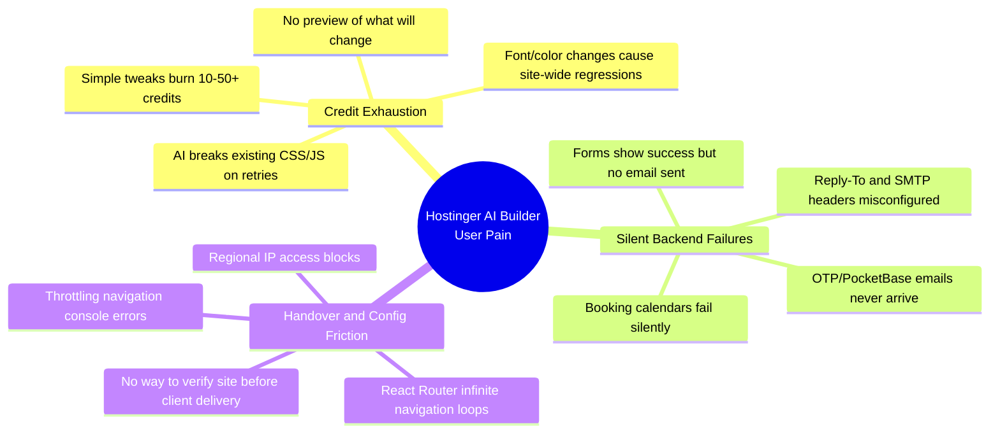

#### Problem 1 — Credit Exhaustion & Code Regressions

> **What happens:** A user asks the AI to "change the font" or "fix the contact form header." The AI does that — but also resets the color scheme, breaks the navigation layout, or alters global CSS variables. The user then spends more credits trying to undo the damage.

- **Affected Discord users:** `Deleted User`, `iamsirjones`, `Philippe`, `zDaan`
- **Root cause:** Prompts are unscoped. The AI treats every request as license to regenerate large sections of the site.
- **Cost to user:** Direct financial loss (credits) + time + frustration.

#### Problem 2 — Silent Backend & Form Failures

> **What happens:** A contact form or booking calendar displays "Thank you, your message was sent!" — but no email ever arrives. The failure is invisible until a customer complains that their booking was never received.

- **Affected Discord users:** `Doughboy` (booking calendar), `Rapidwebstudio` (PocketBase/OTP emails)
- **Root cause:** The frontend success message is decoupled from actual backend delivery. Missing `Reply-To` headers, broken SMTP configuration, and unexecuted API calls go undetected.
- **Cost to user:** Lost leads, lost bookings, damaged reputation — often discovered too late.

#### Problem 3 — Client Handover & Configuration Friction

> **What happens:** A freelancer builds a site, but it has an infinite React Router redirect loop (`"Throttling navigation to prevent browser hang"`), or it's inaccessible from certain regions. They have no way to verify site health before handing it to a client.

- **Affected Discord users:** `Noam 753` (router loops, export), `CHENG HAO YONG` (regional IP access)
- **Root cause:** No pre-delivery QA tooling exists for AI Builder sites. Problems surface only after the client reports them.
- **Cost to user:** Rework, client dissatisfaction, professional credibility.

### 1.3 Why Existing Tools Don't Solve This

| Existing Approach | Why It Fails |
|-------------------|-------------|
| Manual re-prompting | Wastes credits, no guarantee of a scoped fix |
| Generic website testing tools | Not aware of AI Builder credit model or prompt behavior |
| Browser DevTools | Requires technical skill the target user doesn't have |
| Trial and error | Expensive, slow, and destroys existing work |

**The gap:** There is no tool that (a) protects credits by producing scoped prompts *before* they hit AI Builder, and (b) verifies backend/form/routing health *before* a site goes live or ships to a client.

---

## 2. The Solution

### 2.1 Solution Statement

**FixGuard AI is a pre-flight testing and prompt-refining safety net that sits alongside Hostinger AI Builder.** It does not replace AI Builder — it protects users from wasting credits and shipping broken sites.

Users run their site or their intended change through FixGuard *before* acting in AI Builder. FixGuard returns credit-optimized surgical prompts and full diagnostic reports.

### 2.2 The Four Modules

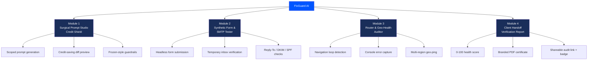

### 2.3 How Each Module Works

#### Module 1 — Surgical Prompt Studio (Credit Shield)
The user describes what they want (*"Make the booking button blue"*). FixGuard extracts the relevant DOM/code, identifies what must stay frozen (global tokens, parent layout, fonts), and generates a scoped prompt:

> *"Modify ONLY the CSS `background` property of `#booking-submit-btn` to `#0055FF`. DO NOT alter parent flexbox properties, global color tokens, or font families. Return only the isolated code change."*

The user pastes this into AI Builder — one credit, one precise fix, no regressions.

#### Module 2 — Synthetic Form & SMTP Tester
The user enters their form URL. FixGuard dispatches a headless Playwright browser that fills the form with test data, submits it to a temporary FixGuard inbox, and verifies:
- Did the client-side JavaScript crash?
- Did the HTTP endpoint return 200?
- Did the email actually arrive?
- Are the `Reply-To`, `From`, DKIM, and SPF headers correct?
- Is this a **silent failure** (success shown but nothing happened)?

#### Module 3 — Router & Geo-Health Auditor
FixGuard crawls the site's client-side routes, listening for the `"Throttling navigation..."` warning, detecting infinite `useEffect` loops, capturing console errors, and pinging the domain from three global regions to detect geo-blocks.

#### Module 4 — Client Handoff Verification Report
All results roll up into a 0–100 Site Health Score and a branded PDF certificate plus a shareable web report — so freelancers can hand clients proof that the site is verified.

---

## 3. Problem → Solution Mapping

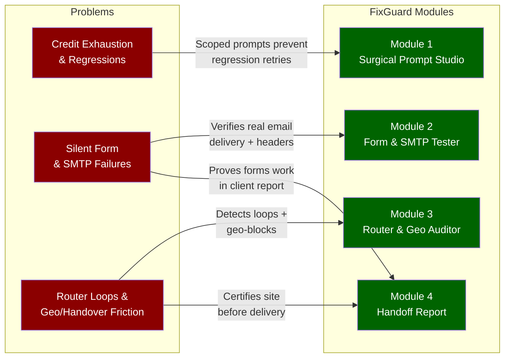

| Problem | FixGuard Solution | Measurable Outcome |
|---------|-------------------|--------------------|
| Credit exhaustion on simple tweaks | Surgical Prompt Studio scopes every change to a single selector with frozen-style guardrails | Estimated 80%+ reduction in retry credits per fix |
| AI breaks existing styling | "DO NOT modify" clauses freeze global tokens, layout, fonts | Zero unintended regressions in scoped fixes |
| Silent form/booking failures | Synthetic form test verifies real email delivery end-to-end | 100% of silent failures surfaced before go-live |
| Missing Reply-To / SMTP headers | Header verification engine audits Reply-To, From, DKIM, SPF | Header misconfigurations flagged with fix guidance |
| React Router infinite loops | Console listener catches `Throttling navigation` + loop detection | Loops identified with originating route/component |
| Regional IP access blocks | Multi-region geo-ping across 3 continents | Geo-blocks detected per-region before client complains |
| No pre-delivery QA proof | Health score + branded PDF + shareable link | Freelancers deliver verified sites with certificate |

---

## 4. Architecture Design

The architecture is documented using the **C4 model** (Context → Container → Component → Code), plus deployment and data-flow views.

### 4.1 System Context Diagram (C4 Level 1)

Shows FixGuard AI as a single system and its relationships with users and external systems.

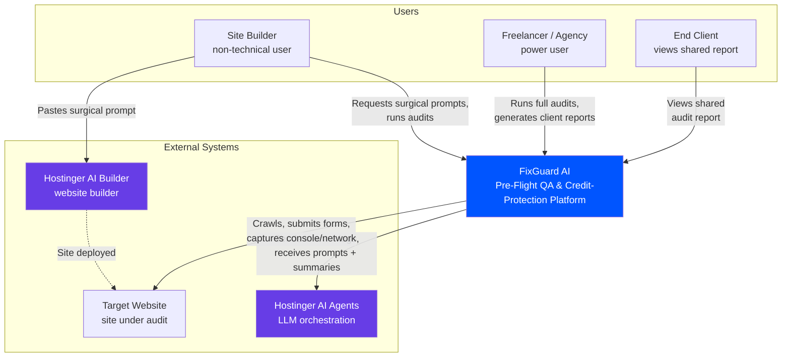

**Narrative:** Builders and agencies interact with FixGuard to get scoped prompts and audit reports. FixGuard calls Hostinger AI Agents for intelligence, crawls the target website for diagnostics, and produces prompts the user pastes back into AI Builder. Clients only ever see the shared report.

### 4.2 Container Diagram (C4 Level 2)

Shows the high-level technical building blocks (containers) and how they communicate, mapped to Hostinger products.

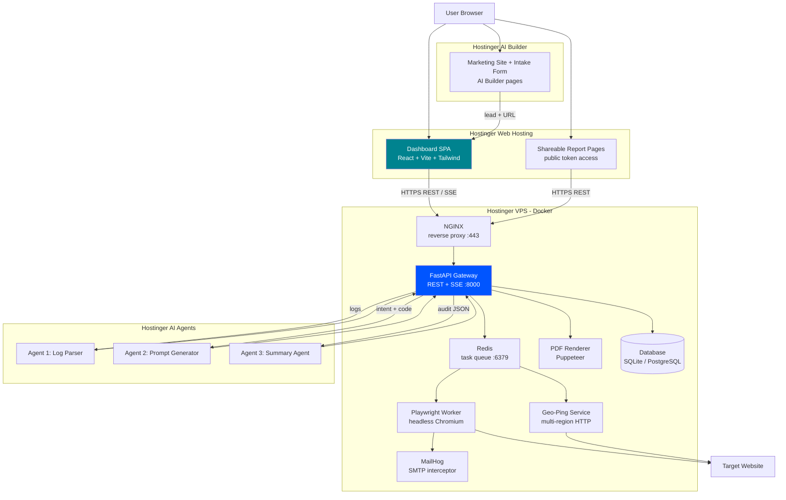

**Container responsibilities:**

| Container | Product | Responsibility |
|-----------|---------|----------------|
| Marketing Site + Intake Form | AI Builder | Lead capture, quick-audit intake, sales page |
| Dashboard SPA | Web Hosting | All user interactions, audit control, report views |
| Shareable Report Pages | Web Hosting | Public token-accessed client reports |
| NGINX | VPS | TLS termination, reverse proxy, rate limiting |
| FastAPI Gateway | VPS | REST API, SSE streaming, orchestration |
| Redis | VPS | Async job queue for audit workers |
| Playwright Worker | VPS | Headless crawling, form submission, console capture |
| MailHog | VPS | Temporary inbox + SMTP header capture |
| Geo-Ping Service | VPS | Multi-region reachability checks |
| PDF Renderer | VPS | HTML-to-PDF certificate generation |
| Database | VPS | Persist users, projects, audits, results, prompts |
| Agent 1/2/3 | AI Agents | Log parsing, prompt generation, summaries |

### 4.3 Component Diagrams (C4 Level 3)

#### 4.3.1 FastAPI Gateway — Internal Components

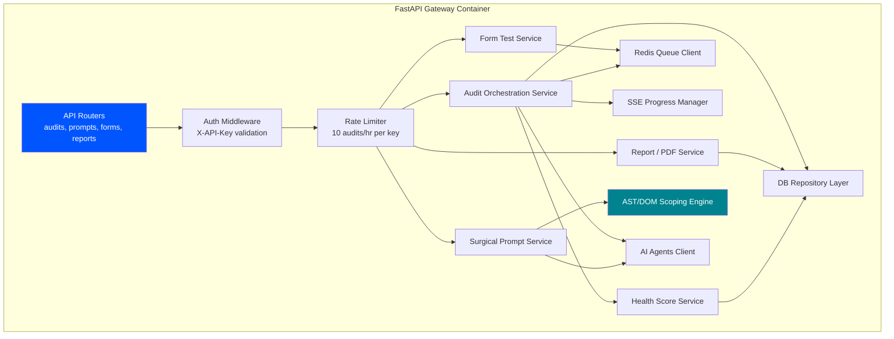

#### 4.3.2 Playwright Worker — Internal Components

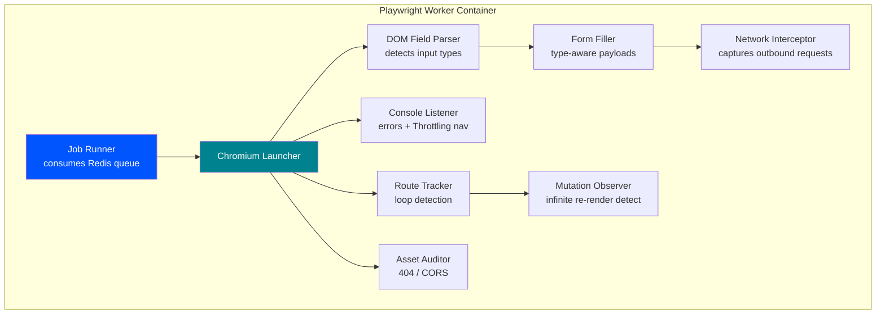

### 4.4 Deployment Diagram

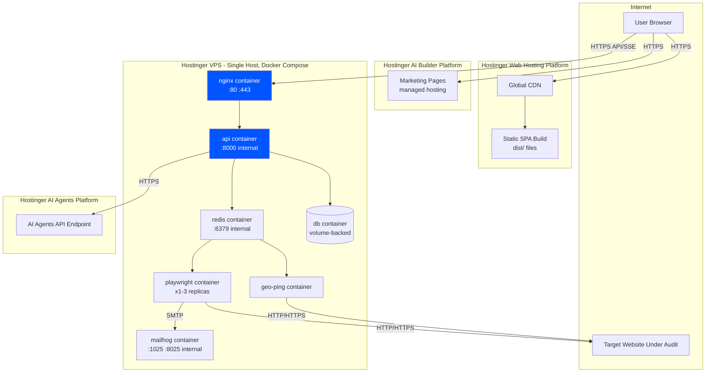

**Deployment notes:**
- All VPS services run on a **single Docker Compose stack** on one Hostinger VPS host (sufficient for hackathon scale).
- Only NGINX ports (80/443) are exposed externally; all other services communicate over the internal Docker network.
- Playwright container can scale to 1–3 replicas via `docker compose up --scale playwright=3`.
- Database uses a Docker volume for persistence; SQLite for MVP, PostgreSQL container for production.

### 4.5 Data Flow Architecture (End-to-End)

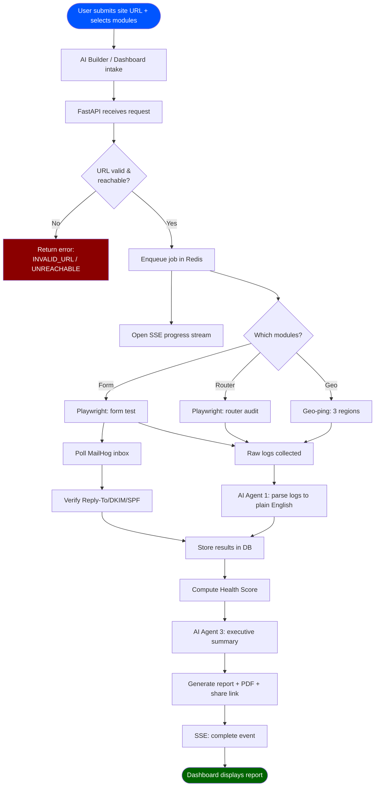

---

## 5. User Flow Design

### 5.1 Onboarding Flow

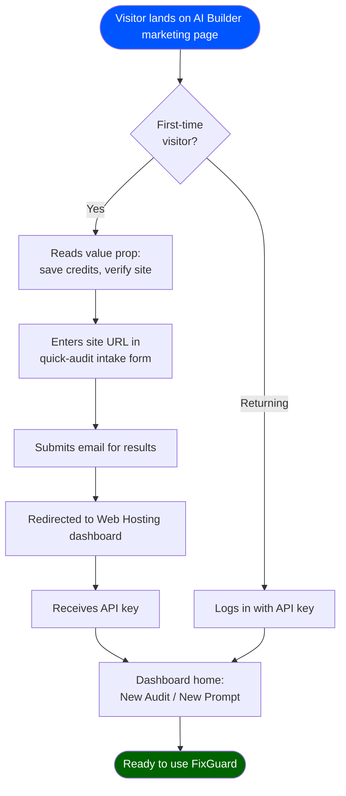

### 5.2 Surgical Prompt Flow (Module 1)

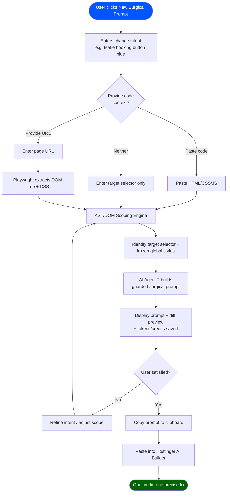

### 5.3 Synthetic Form Audit Flow (Module 2)

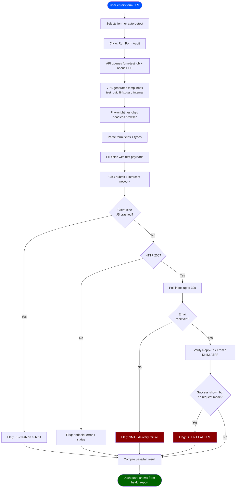

### 5.4 Full Site Audit Flow (Modules 2+3+4)

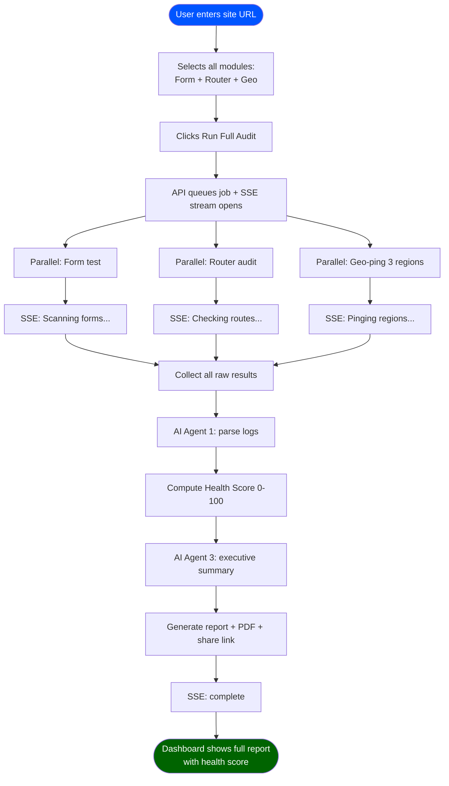

### 5.5 Client Handoff Flow (Module 4)

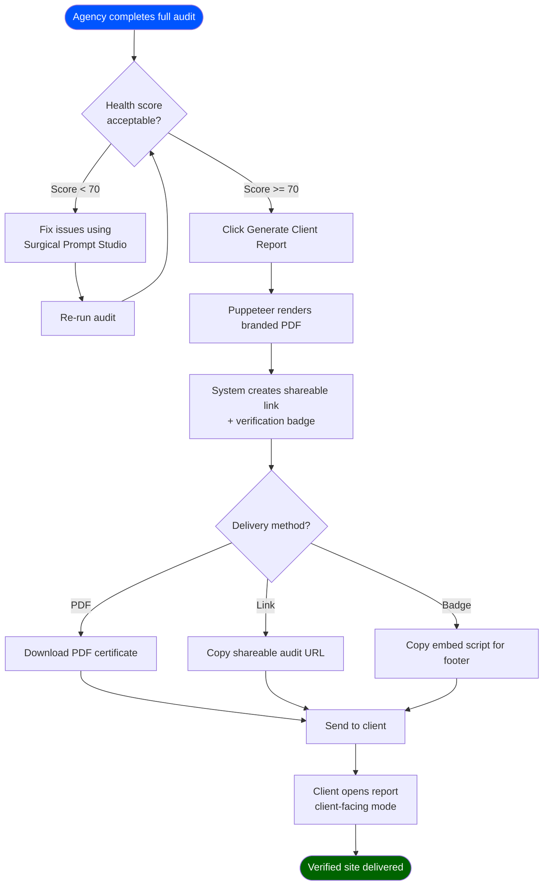

### 5.6 User Journey Map

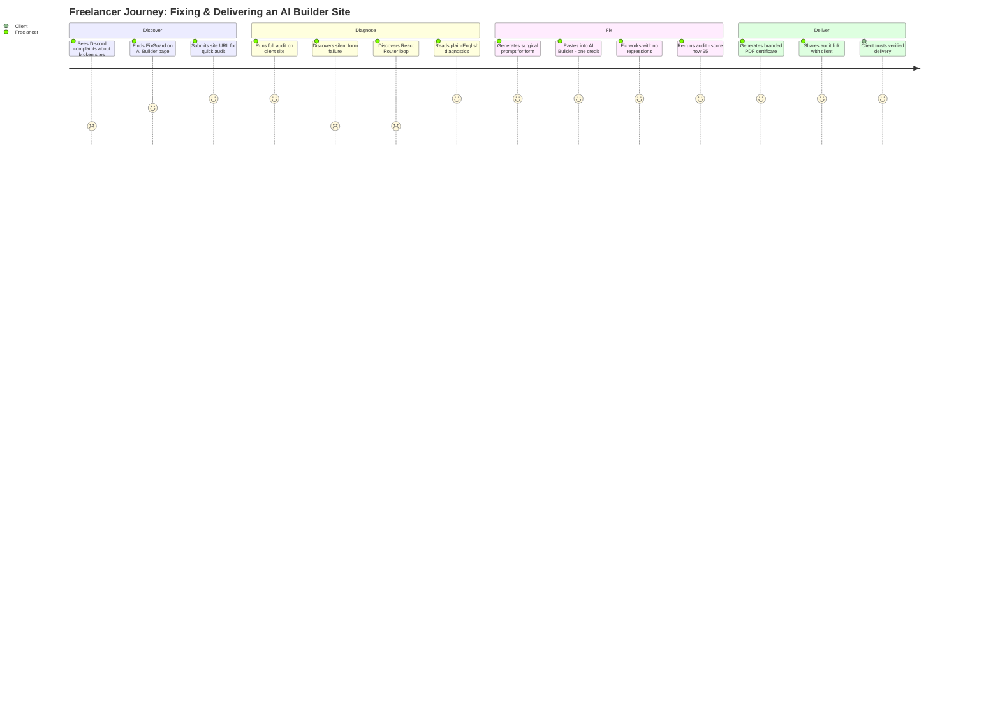

---

## 6. Entity Relationship Diagram (ERD)

### 6.1 Full ERD with Cardinality

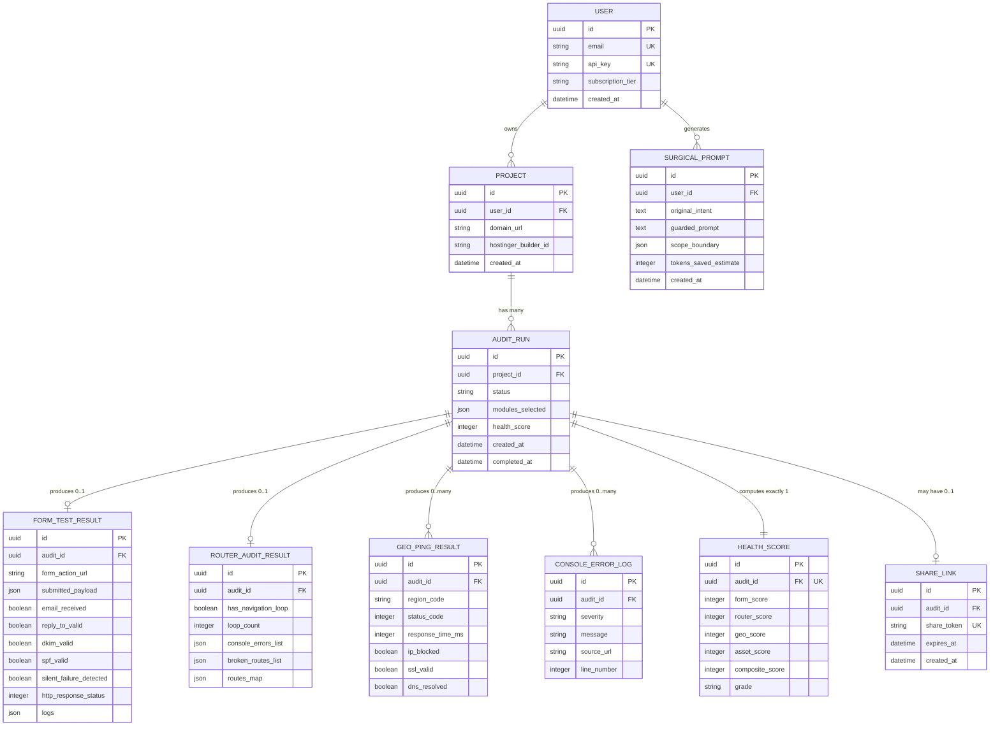

### 6.2 Relationship Narrative

| Relationship | Cardinality | Meaning |
|--------------|-------------|---------|
| USER → PROJECT | 1 to many | A user can register multiple website projects |
| USER → SURGICAL_PROMPT | 1 to many | A user generates many surgical prompts over time |
| PROJECT → AUDIT_RUN | 1 to many | Each project accumulates a history of audit runs |
| AUDIT_RUN → FORM_TEST_RESULT | 1 to 0..1 | An audit has at most one form test result (only if Form module selected) |
| AUDIT_RUN → ROUTER_AUDIT_RESULT | 1 to 0..1 | An audit has at most one router result (only if Router module selected) |
| AUDIT_RUN → GEO_PING_RESULT | 1 to many | An audit produces one geo-ping row per region (typically 3) |
| AUDIT_RUN → CONSOLE_ERROR_LOG | 1 to many | An audit captures zero or more console errors |
| AUDIT_RUN → HEALTH_SCORE | 1 to 1 | Every completed audit computes exactly one health score |
| AUDIT_RUN → SHARE_LINK | 1 to 0..1 | An audit may optionally have one shareable link |

### 6.3 Key Design Decisions

- **UUID primary keys** everywhere — prevents enumeration attacks and enables safe distributed generation.
- **Cascading deletes** — deleting a user removes their projects, audits, and results (GDPR compliance).
- **JSON columns** for flexible payloads (`console_errors_list`, `routes_map`, `submitted_payload`) — avoids over-normalizing volatile audit data.
- **Separate HEALTH_SCORE table** with a unique constraint on `audit_id` — enforces exactly one score per audit and keeps score breakdown queryable.
- **GEO_PING_RESULT as one row per region** — allows per-region filtering and future addition of more regions without schema changes.
- **SHARE_LINK with token + expiry** — decouples public sharing from the audit record and supports 30-day expiry.

---

## 7. Use Case Model

### 7.1 Use Case Diagram

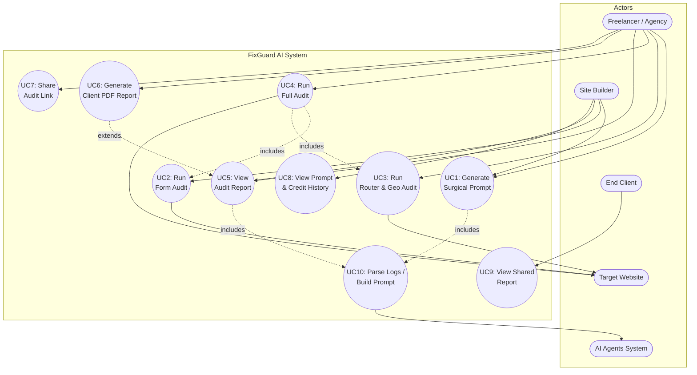

### 7.2 Detailed Use Case Specifications

---

#### UC1: Generate Surgical Prompt

| Field | Detail |
|-------|--------|
| **Actor** | Site Builder, Freelancer/Agency |
| **Goal** | Obtain a scoped, credit-saving prompt to paste into AI Builder |
| **Preconditions** | User is authenticated with a valid API key |
| **Trigger** | User clicks "New Surgical Prompt" |
| **Priority** | High (core value proposition) |

**Main Flow:**
1. User enters change intent (e.g., "Make the booking button blue").
2. User optionally provides code context, a page URL, or a target selector.
3. If a URL is provided, the system dispatches Playwright to extract the DOM tree and CSS.
4. The AST/DOM Scoping Engine identifies the target selector and the global styles to freeze.
5. The system invokes AI Agent 2 to construct a guarded surgical prompt (**includes UC10**).
6. The system displays the prompt, a before/after diff preview, and estimated tokens/credits saved.
7. User copies the prompt to the clipboard.

**Alternative Flows:**
- **A1 (No context):** If no code, URL, or selector is provided, the system requests at least one before proceeding.
- **A2 (Refine):** If the user is not satisfied, they adjust the intent or scope and the system regenerates (return to step 4).

**Postconditions:** A `SURGICAL_PROMPT` record is stored with the original intent, guarded prompt, and tokens-saved estimate.

**Exceptions:** If AI Agents returns an error, the system falls back to a static guardrail template and notifies the user.

---

#### UC2: Run Form Audit

| Field | Detail |
|-------|--------|
| **Actor** | Site Builder, Freelancer/Agency |
| **Goal** | Verify that a form actually delivers emails with correct headers |
| **Preconditions** | User authenticated; target URL reachable |
| **Trigger** | User clicks "Run Form Audit" |
| **Priority** | High |

**Main Flow:**
1. User enters the form URL and selects a form (or chooses auto-detect).
2. System queues a form-test job in Redis and opens an SSE progress stream.
3. VPS generates a temporary inbox (`test_<uuid>@fixguard.internal`).
4. Playwright launches a headless browser, parses form fields, and fills them with type-appropriate test data.
5. Playwright clicks submit, intercepts outbound network requests, and captures JS errors and the HTTP status.
6. System polls the temporary inbox for up to 30 seconds.
7. If an email arrives, the system verifies `Reply-To`, `From`, DKIM, and SPF headers.
8. System compiles a pass/fail result and displays it on the dashboard.

**Alternative Flows:**
- **A1 (JS crash):** If client-side JS crashes on submit, the system flags "JS crash on submit."
- **A2 (Non-200):** If the endpoint returns non-200, the system flags the specific status code.
- **A3 (No email):** If no email arrives in 30s, the system flags "SMTP delivery failure."
- **A4 (Silent failure):** If a success message is shown but no HTTP request was made, the system flags "Silent Failure."

**Postconditions:** A `FORM_TEST_RESULT` record is stored and linked to the audit run.

**Exceptions:** If the target is unreachable, the system returns `UNREACHABLE_TARGET`.

---

#### UC3: Run Router & Geo Audit

| Field | Detail |
|-------|--------|
| **Actor** | Freelancer/Agency, Site Builder |
| **Goal** | Detect navigation loops, console errors, and regional access blocks |
| **Preconditions** | User authenticated; target URL reachable |
| **Trigger** | User clicks "Run Router & Geo Audit" |
| **Priority** | High |

**Main Flow:**
1. User enters the site URL and selects the Router and Geo modules.
2. System queues the job and opens an SSE stream.
3. Playwright navigates the site, listening for `"Throttling navigation..."` and tracking route changes.
4. Playwright detects loops (≥5 navigations to the same URL in 3s) and captures console errors with source/line.
5. In parallel, the Geo-Ping service pings the URL from US-East, EU-Central, and Asia-South.
6. Each region records status code, latency, SSL validity, and DNS resolution.
7. System flags any region-specific blocks (e.g., 403 in one region only).
8. AI Agent 1 parses console logs into plain English (**includes UC10**).
9. System displays the route map, loop warnings, and geo-block alerts.

**Alternative Flows:**
- **A1 (Loop detected):** System reports the originating route/component and stack trace if available.
- **A2 (Region unavailable):** If a geo-ping node is unavailable, the system reports "unavailable" for that region and continues.

**Postconditions:** `ROUTER_AUDIT_RESULT`, `GEO_PING_RESULT` (per region), and `CONSOLE_ERROR_LOG` records are stored.

---

#### UC4: Run Full Audit

| Field | Detail |
|-------|--------|
| **Actor** | Freelancer/Agency |
| **Goal** | Run all diagnostic modules and compute an overall health score |
| **Preconditions** | User authenticated; target URL reachable |
| **Trigger** | User clicks "Run Full Audit" |
| **Priority** | High |

**Main Flow:**
1. User enters the site URL and selects all modules.
2. System queues the job and opens an SSE stream.
3. System runs the Form Audit (**includes UC2**) and Router & Geo Audit (**includes UC3**) in parallel.
4. System collects all raw results and invokes AI Agent 1 for parsing.
5. System computes the composite Health Score (weighted across categories).
6. AI Agent 3 generates an executive summary.
7. System generates the report, PDF, and shareable link, then emits the SSE `complete` event.
8. Dashboard displays the full report with the health score.

**Postconditions:** A completed `AUDIT_RUN` with a `HEALTH_SCORE` and all sub-results.

**Exceptions:** If any single module times out, the system reports partial results and marks the module as failed rather than failing the whole audit.

---

#### UC5: View Audit Report

| Field | Detail |
|-------|--------|
| **Actor** | Site Builder, Freelancer/Agency |
| **Goal** | Review complete audit findings |
| **Preconditions** | A completed audit run exists |
| **Trigger** | User selects an audit from history |

**Main Flow:**
1. User navigates to audit history and selects a run.
2. System retrieves the full audit report JSON (**includes UC10** for parsed diagnostics).
3. Dashboard renders the health score, per-category breakdown, form results, router map, geo results, and executive summary.

**Alternative Flows:**
- **A1 (Toggle mode):** User toggles between client-facing (simplified) and developer-facing (full detail) views.

---

#### UC6: Generate Client PDF Report

| Field | Detail |
|-------|--------|
| **Actor** | Freelancer/Agency |
| **Goal** | Produce a branded PDF certificate for client delivery |
| **Preconditions** | A completed audit exists (**extends UC5**) |
| **Trigger** | User clicks "Generate Client Report" |

**Main Flow:**
1. User views a completed audit report.
2. User clicks "Generate Client Report."
3. Puppeteer renders a branded HTML template to PDF including the health score and check breakdown.
4. System streams the PDF for download.

**Postconditions:** A downloadable PDF is produced (no new DB record required beyond the audit).

---

#### UC7: Share Audit Link

| Field | Detail |
|-------|--------|
| **Actor** | Freelancer/Agency |
| **Goal** | Generate a public, token-based shareable audit URL |
| **Preconditions** | A completed audit exists |
| **Trigger** | User clicks "Share Report" |

**Main Flow:**
1. User clicks "Share Report" on a completed audit.
2. System generates an unguessable UUID token and a `SHARE_LINK` record with a 30-day expiry.
3. System returns the shareable URL and an embeddable badge script.
4. User copies the link or badge script.

**Postconditions:** A `SHARE_LINK` record is created.

---

#### UC8: View Prompt & Credit History

| Field | Detail |
|-------|--------|
| **Actor** | Site Builder, Freelancer/Agency |
| **Goal** | Review past surgical prompts and cumulative credit savings |
| **Preconditions** | User authenticated |
| **Trigger** | User opens "Prompt History" |

**Main Flow:**
1. User opens Prompt History.
2. System retrieves all `SURGICAL_PROMPT` records for the user.
3. Dashboard displays each prompt with intent, guarded output, and tokens saved, plus a cumulative credits-saved total.

---

#### UC9: View Shared Report

| Field | Detail |
|-------|--------|
| **Actor** | End Client |
| **Goal** | View an audit report shared by an agency, without authentication |
| **Preconditions** | A valid, non-expired share link exists |
| **Trigger** | Client opens the shared URL |

**Main Flow:**
1. Client opens the shareable URL.
2. System validates the token and expiry.
3. System renders the report in client-facing mode (executive summary + health score).

**Alternative Flows:**
- **A1 (Expired):** If the link is expired, the system returns `410 Gone` with a friendly message.

---

#### UC10: Parse Logs / Build Prompt (System Use Case)

| Field | Detail |
|-------|--------|
| **Actor** | AI Agents System (secondary actor) |
| **Goal** | Provide intelligence: parse logs, generate prompts, summarize |
| **Type** | Included by UC1, UC3, UC4, UC5 |

**Main Flow:**
1. FixGuard sends raw input (console logs, user intent + code scope, or audit JSON) to the appropriate agent.
2. Agent 1 parses raw stack traces into plain-English diagnostics.
3. Agent 2 wraps user intent in strict CSS/JS guardrails to produce a surgical prompt.
4. Agent 3 converts raw audit data into a client-facing executive summary.
5. Agent returns structured output to FixGuard.

**Exceptions:** On agent error or timeout, the calling use case falls back to a static template or raw data with a warning.

---

## 8. Appendix: Design Principles

| Principle | Application in FixGuard AI |
|-----------|----------------------------|
| **Advisory, not destructive** | FixGuard never edits the user's site directly — it produces prompts the user chooses to apply |
| **Credit-first** | Every design decision optimizes for minimizing AI Builder credit consumption |
| **Fail loud, not silent** | The system's core job is surfacing silent failures — it must never hide its own |
| **Parallel where possible** | Audit modules run concurrently to meet the < 60s target |
| **Graceful degradation** | Partial results are better than total failure; each module fails independently |
| **Non-decorative integration** | Every Hostinger product performs an essential function (proven by removal test) |
| **Token-safe sharing** | Public links use unguessable UUIDs with expiry, never sequential IDs |
| **Human-readable output** | Raw stack traces are always translated to plain English via AI Agents |

---

**Document End — FixGuard AI System Design Document v1.0**
