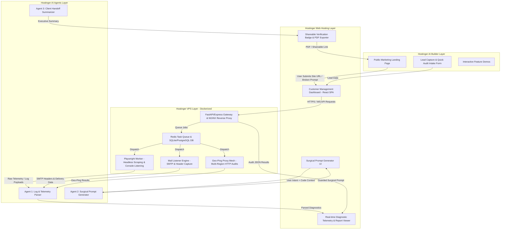
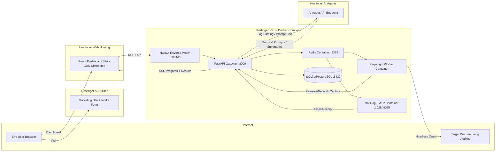
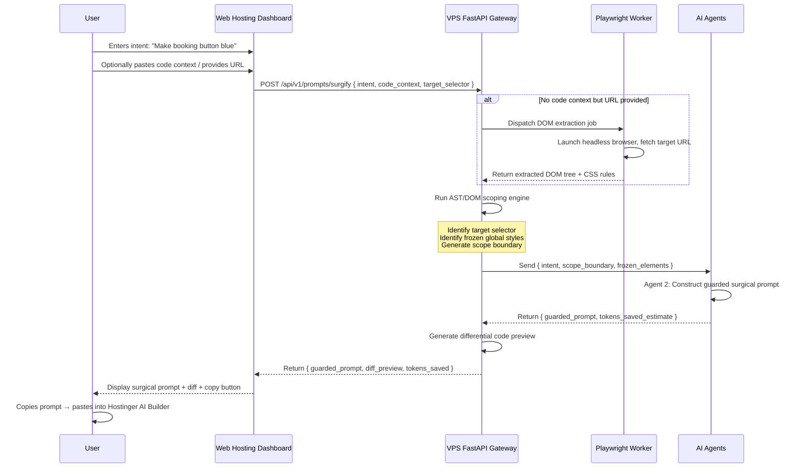
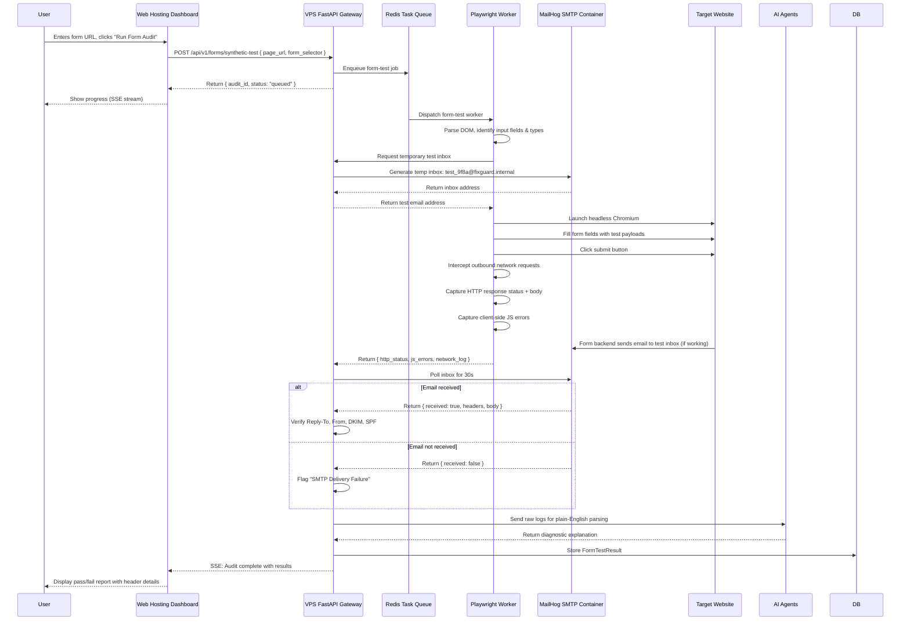
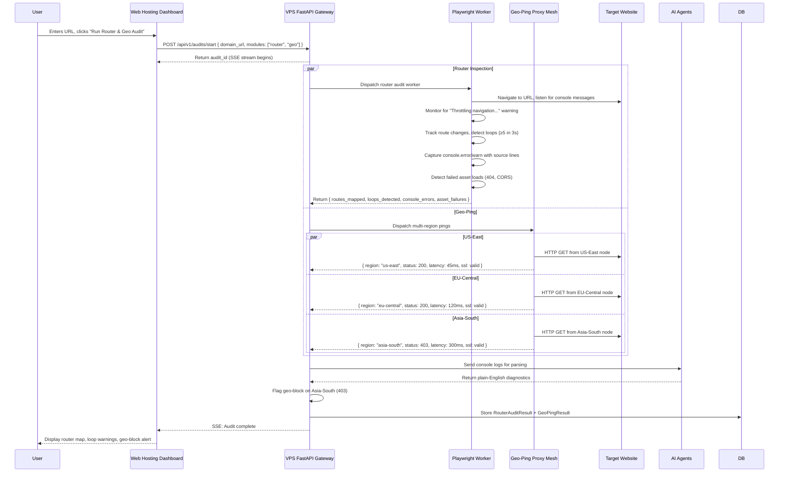
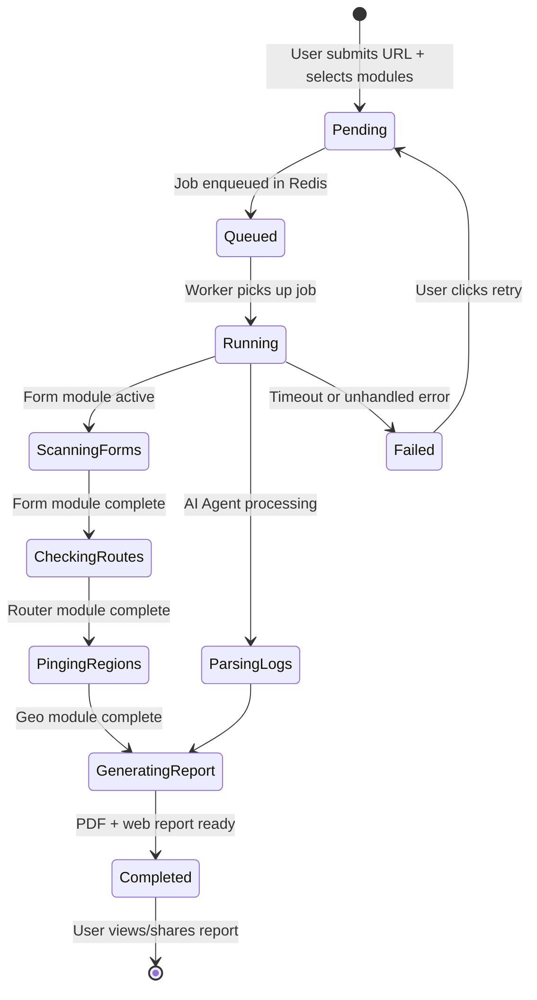
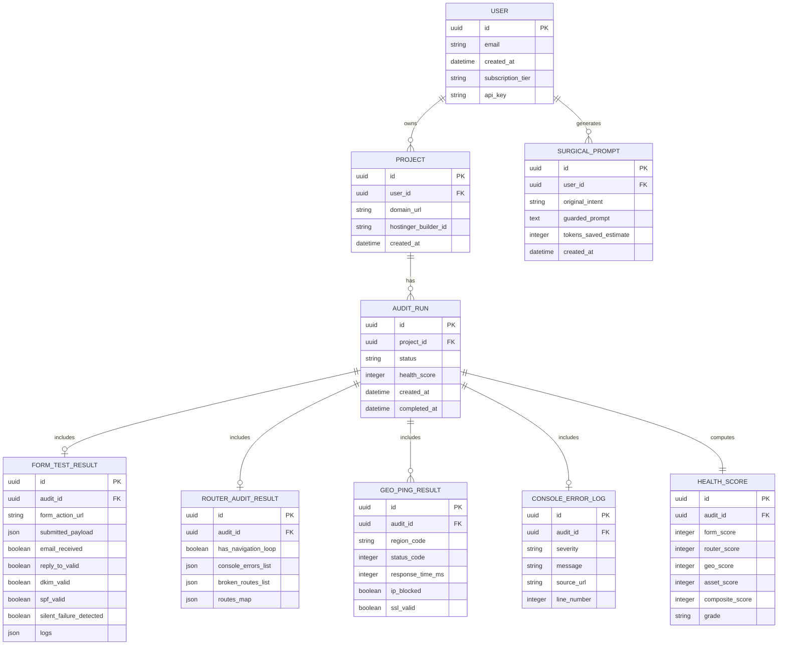
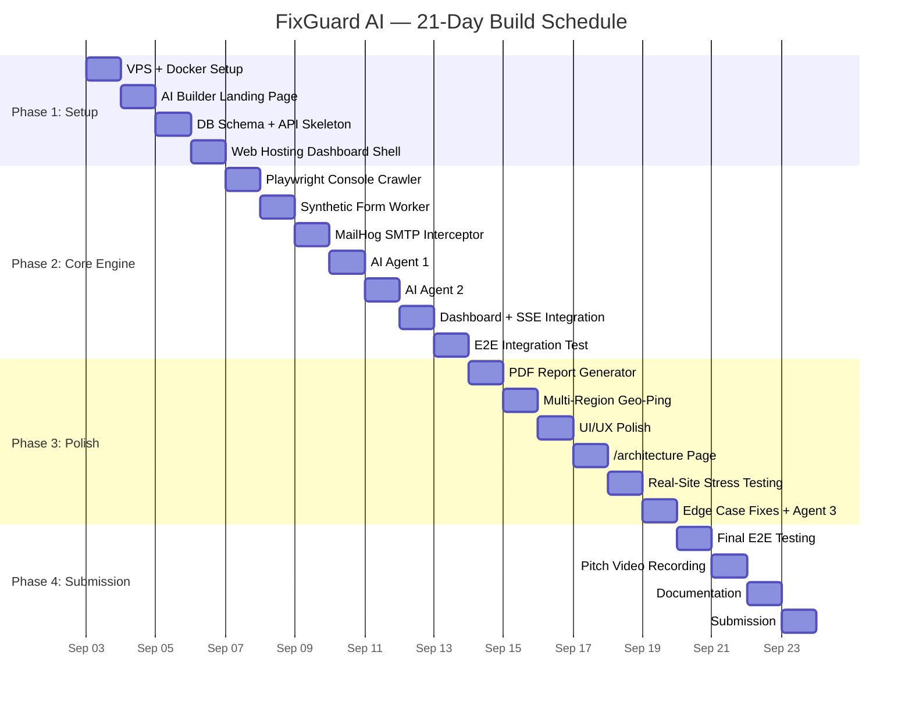

# FixGuard AI — Software Requirements Specification (SRS)

**Document Version:** 1.0
**Date:** August 30, 2026
**Project:** FixGuard AI — Pre-Flight QA & Credit-Protection Platform for Hostinger AI Builder
**Hackathon:** Hostinger Challenge (21-Day Build Cycle)
**Status:** Approved for Development

---

## Table of Contents

1. [Introduction](#1-introduction)
2. [Stakeholders & User Personas](#2-stakeholders--user-personas)
3. [Scope & Boundaries](#3-scope--boundaries)
4. [Functional Requirements](#4-functional-requirements)
5. [Non-Functional Requirements](#5-non-functional-requirements)
6. [System Architecture](#6-system-architecture)
7. [Data Model & Database Schema](#7-data-model--database-schema)
8. [API Specification](#8-api-specification)
9. [Hostinger 4-Product Technical Mapping](#9-hostinger-4-product-technical-mapping)
10. [Security & Compliance](#10-security--compliance)
11. [Testing & Quality Assurance](#11-testing--quality-assurance)
12. [21-Day Implementation Plan](#12-21-day-implementation-plan)
13. [Risk Register](#13-risk-register)
14. [Hackathon Pitch & Judging Strategy](#14-hackathon-pitch--judging-strategy)
15. [Appendices](#15-appendices)

---

## 1. Introduction

### 1.1 Purpose

This document constitutes the complete Software Requirements Specification (SRS) for **FixGuard AI**, a pre-flight testing and prompt-refining companion platform built alongside Hostinger AI Builder. It defines the functional and non-functional requirements, system architecture, data models, API contracts, deployment topology, and implementation roadmap for a 21-day hackathon build cycle.

This SRS serves as the single source of truth for all development decisions, scope boundaries, and acceptance criteria throughout the project lifecycle.

### 1.2 Problem Statement

Hostinger AI Builder users — non-technical builders, freelancers, and agency owners — experience three dominant pain points, verified through Discord community transcript analysis:

| # | Pain Point | Evidence (Discord Users) | Impact |
|---|-----------|--------------------------|--------|
| 1 | **Credit Exhaustion & Code Regressions** | `Deleted User`, `iamsirjones`, `Philippe`, `zDaan` | Users burn 10–50+ credits on simple tweaks (font color, contact form header) because the AI breaks existing site styling/features, forcing retries |
| 2 | **Silent Backend & Form Failures** | `Doughboy`, `Rapidwebstudio` | Forms, booking calendars, and PocketBase/OTP emails show "Success" on screen but silently fail to deliver emails or process headers |
| 3 | **Client Handover & Configuration Friction** | `Noam 753`, `CHENG HAO YONG` | Users struggle with exporting sites to clients, fixing React Router infinite loops (`"Throttling navigation..."`), and configuring regional IP access |

### 1.3 Solution Overview

FixGuard AI is a specialized developer companion that sits alongside Hostinger AI Builder. It does **not** replace AI Builder — it protects users from it. The platform operates through four interdependent modules:

1. **Surgical Prompt Studio (Credit Shield):** Analyzes user intent and existing code, then generates scoped, single-purpose prompts that prevent site-wide styling regressions — saving AI Builder credits.
2. **Synthetic Form & SMTP Tester:** Dispatches headless browsers to submit real forms with temporary inboxes, verifying email delivery and header integrity (`Reply-To`, `From`, DKIM, SPF).
3. **Router & Geo-Health Auditor:** Crawls client-side routes to detect infinite navigation loops, console errors, and multi-region IP access blocks.
4. **Client Handoff Verification Report:** Generates branded PDF audit certificates and shareable web reports for agency client delivery.

### 1.4 Definitions & Acronyms

| Term | Definition |
|------|-----------|
| **AI Builder** | Hostinger's AI-powered website builder product |
| **VPS** | Hostinger Virtual Private Server — Dockerized compute environment |
| **Web Hosting** | Hostinger shared/cloud hosting — serves static SPA and dashboard |
| **AI Agents** | Hostinger's AI agent orchestration platform |
| **Surgical Prompt** | A scoped, guardrail-wrapped prompt designed to fix one thing without regressions |
| **Credit** | A unit of AI Builder prompt usage that FixGuard aims to conserve |
| **Audit Run** | A single execution of one or more diagnostic modules against a target URL |
| **Health Score** | A 0–100 composite score derived from audit check results |
| **SSE** | Server-Sent Events — used for real-time audit progress streaming |
| **AST** | Abstract Syntax Tree — used for code-scoping in the prompt engine |
| **SMTP Interceptor** | VPS mail receiver container that captures outbound test emails |

---

## 2. Stakeholders & User Personas

### 2.1 Stakeholders

| Stakeholder | Role | Interest |
|-------------|------|----------|
| **Hostinger Judges** (incl. Igor) | Hackathon evaluators | Product completeness, 4-product integration, community problem alignment |
| **End Users (Builders)** | Primary users | Save credits, fix bugs without breaking sites |
| **Freelancers/Agencies** | Power users | Deliver verified sites to clients with professional reports |
| **Hostinger Community (Discord)** | Feedback source | Direct pain-point validation and beta testing |
| **Development Team** | Builders | Clear specs, realistic scope, achievable 21-day timeline |

### 2.2 User Personas

#### Persona 1: "Sarah" — Non-Technical Site Builder
- **Profile:** Small business owner using Hostinger AI Builder to create her bakery website
- **Goal:** Change button colors and fix a contact form without burning 30 credits
- **Pain:** Every AI prompt breaks her layout; she doesn't know CSS to fix it manually
- **FixGuard Value:** Paste intent → get surgical prompt → one credit, one fix, no regression

#### Persona 2: "Marcus" — Freelance Web Agency Owner
- **Profile:** Delivers 5–10 AI Builder sites per month to clients
- **Goal:** Verify forms work, routes don't loop, and hand over a professional audit certificate
- **Pain:** Clients complain about broken booking forms post-delivery; no way to prove QA
- **FixGuard Value:** Run full audit → generate branded PDF → deliver with confidence

#### Persona 3: "Priya" — Developer Integrating Hostinger
- **Profile:** Builds custom features on top of AI Builder sites
- **Goal:** Debug React Router loops and console errors programmatically
- **Pain:** `"Throttling navigation to prevent browser hang"` with no diagnostic tooling
- **FixGuard Value:** Router audit pinpoints the exact `useEffect` causing the loop

---

## 3. Scope & Boundaries

### 3.1 In Scope

- **Surgical Prompt Studio:** Intent-to-prompt transformation with AST/DOM scoping and guardrail injection
- **Synthetic Form Testing:** Headless form submission with temporary SMTP inbox verification
- **Router & Console Audit:** Playwright-based navigation loop detection and console error capture
- **Geo-Health Ping:** Multi-region HTTP reachability checks (minimum 3 regions)
- **Client Handoff Reports:** PDF generation and shareable web-based audit views
- **Dashboard SPA:** React/Vite frontend for all user interactions
- **API Gateway:** FastAPI backend orchestrating all VPS workers
- **AI Agent Integration:** Log parsing, prompt generation, and summary agents
- **4-Product Integration:** AI Builder, Web Hosting, VPS, AI Agents in an interdependent pipeline

### 3.2 Out of Scope (for hackathon MVP)

- User authentication and multi-tenant billing (use API-key-based access for demo)
- Real-time CDN monitoring and uptime dashboards (single-snapshot audits only)
- Automated deployment to Hostinger AI Builder (FixGuard generates prompts; user pastes manually)
- Mobile native apps (responsive web only)
- Multi-language localization (English only for MVP)
- AI Builder site code editing directly (FixGuard is advisory, not an editor)

### 3.3 Success Criteria

| Criterion | Target |
|-----------|--------|
| All 4 Hostinger products demonstrably interconnected in live demo | Required |
| End-to-end audit loop completes in < 60 seconds for a single URL | Target |
| Surgical prompt generator produces scoped output for 5+ input types | Required |
| Synthetic form test detects at least 1 real failure mode (missing email, bad header) | Required |
| Router audit catches `Throttling navigation` console warning | Required |
| Client handoff PDF generates successfully with health score | Required |
| Live `/architecture` page showing 4-product data flow | Required |
| 2-minute pitch video submitted | Required |

---

## 4. Functional Requirements

### 4.1 Module 1: Surgical Prompt Studio (Credit Shield)

#### FR-1.1: Intent Input & Code Context Capture
**Description:** The system shall accept a user's natural-language change intent and optional existing code/DOM context.
**Input:** `{ intent: string, code_context?: string, target_selector?: string }`
**Acceptance Criteria:**
- User can type a free-text intent (e.g., "Make the booking button blue")
- User can paste existing HTML/CSS/JS code as context
- User can specify a target CSS selector for scoping
- System validates that intent is non-empty and ≤ 500 characters

#### FR-1.2: AST/DOM Scoping Engine
**Description:** The system shall analyze the provided code context to isolate the exact elements and properties relevant to the user's intent.
**Acceptance Criteria:**
- System parses HTML to identify target element by selector or semantic match
- System identifies global CSS variables, theme tokens, and parent container styles to freeze
- System generates a scope boundary listing what to change and what to preserve
- If no code context is provided, system prompts user to provide a URL for Playwright DOM extraction

#### FR-1.3: Guardrail Prompt Generation (via AI Agents)
**Description:** The system shall invoke Hostinger AI Agents to transform the user intent + scope boundary into a surgical, copy-paste prompt.
**Acceptance Criteria:**
- Generated prompt explicitly scopes changes to the identified selector/property
- Generated prompt includes "DO NOT modify" clauses for frozen elements
- Generated prompt enforces single-file, differential code modification
- Generated prompt is ≤ 300 tokens to minimize credit consumption
- Output includes a `tokens_saved_estimate` comparing naive prompt vs. surgical prompt

#### FR-1.4: Differential Code Preview
**Description:** The system shall display a before/after diff preview showing exactly what the surgical prompt would change.
**Acceptance Criteria:**
- UI renders a side-by-side diff view (original vs. proposed change)
- Only the targeted lines are highlighted as changed
- Unchanged global styles are visually marked as "frozen"
- User can copy the surgical prompt to clipboard with one click

#### FR-1.5: Prompt History & Credit Impact Estimator
**Description:** The system shall store all generated prompts and estimate credit savings.
**Acceptance Criteria:**
- Each generated prompt is persisted with timestamp, original intent, and guarded output
- Credit impact estimator calculates estimated tokens saved vs. naive retry approach
- History view shows cumulative estimated credits saved across all prompts

---

### 4.2 Module 2: Synthetic Form & SMTP Testing Suite

#### FR-2.1: Target URL & Form Selector Input
**Description:** The system shall accept a target page URL and optional form CSS selector.
**Input:** `{ page_url: string, form_selector?: string, test_email?: string }`
**Acceptance Criteria:**
- System validates URL format and reachability
- If no selector provided, system auto-detects `<form>` elements on the page
- User can specify a custom test email or use auto-generated temporary inbox

#### FR-2.2: Autonomous DOM Field Parser
**Description:** The system shall parse the target form to identify all input fields and their types.
**Acceptance Criteria:**
- System identifies standard input types: `text`, `email`, `textarea`, `select`, `radio`, `checkbox`, `tel`, `date`
- System generates appropriate test payloads for each field type
- System maps submit button location for click simulation
- System detects `action` URL and `method` (GET/POST) of the form

#### FR-2.3: Headless Form Submission (Playwright Worker)
**Description:** The system shall dispatch a headless Chromium browser via Playwright to fill and submit the target form.
**Acceptance Criteria:**
- Worker fills all detected input fields with type-appropriate test data
- Worker clicks the submit button and waits for response (max 15s timeout)
- Worker intercepts all outbound network requests during submission
- Worker captures any client-side JavaScript errors during submission
- Worker captures the HTTP response status code and body

#### FR-2.4: Temporary SMTP Inbox Generation
**Description:** The VPS shall generate a temporary email inbox to receive test emails from submitted forms.
**Acceptance Criteria:**
- System generates a unique temporary email address (e.g., `test_<uuid>@fixguard.internal`)
- VPS mail receiver container (MailHog/Postfix) captures inbound SMTP
- System polls the inbox for up to 30 seconds post-submission
- System reports whether email was received, with timestamp and full headers

#### FR-2.5: Email Header Verification
**Description:** The system shall verify email header integrity for received test emails.
**Acceptance Criteria:**
- System validates `Reply-To` header matches the sender email input in the form
- System checks `From` header for proper domain
- System verifies DKIM signature presence and validity
- System checks SPF record alignment
- System flags any missing or misconfigured headers with specific failure messages

#### FR-2.6: Silent Failure Detection
**Description:** The system shall detect forms that display success messages without executing backend API calls.
**Acceptance Criteria:**
- System compares frontend success indicator (success message, redirect, toast) with actual HTTP request completion
- If frontend shows success but no HTTP request was made → flag as "Silent Failure"
- If HTTP request returns non-200 → flag with specific status code
- If HTTP request succeeds but no email arrives within 30s → flag as "SMTP Delivery Failure"

---

### 4.3 Module 3: Router & Geo-Health Auditor

#### FR-3.1: Client-Side Router Inspection
**Description:** The system shall crawl the target site's client-side routes to detect navigation anomalies.
**Acceptance Criteria:**
- Worker navigates to the target URL and records all client-side route changes
- Worker listens for console message: `"Throttling navigation to prevent browser hang"`
- Worker detects rapid repeated navigation to the same URL (≥ 5 in 3 seconds = loop)
- Worker maps route depth and identifies fallback/catch-all redirects
- Worker reports broken routes (404 on client-side path)

#### FR-3.2: Infinite Re-Render Detection
**Description:** The system shall detect React `useEffect` dependency loops causing infinite re-renders.
**Acceptance Criteria:**
- Worker monitors for rapid DOM mutations (≥ 50 mutations in 2 seconds = suspected loop)
- Worker captures React DevTools console warnings if available
- Worker reports the suspected component/route where the loop originates
- Worker provides stack trace if available from console errors

#### FR-3.3: Console Error & Asset Failure Audit
**Description:** The system shall capture all console errors and asset load failures during page load.
**Acceptance Criteria:**
- Worker captures `console.error`, `console.warn` messages with source and line number
- Worker detects failed asset loads (images returning 404, broken CDN links, CORS violations)
- Worker categorizes errors by severity: Critical (JS crash), Warning (deprecation), Info (CORS)
- Worker provides a count and list of all unique errors

#### FR-3.4: Multi-Region Geo-Ping
**Description:** The system shall verify domain reachability across multiple geographic regions.
**Acceptance Criteria:**
- System pings target URL from minimum 3 regions: US-East, EU-Central, Asia-South
- Each region check records: HTTP status code, response time (ms), SSL validity, DNS resolution
- System flags region-specific blocks (403/451 in one region but 200 in others)
- System reports geo-blocking detection with affected region list

---

### 4.4 Module 4: Client Handoff Verification Report

#### FR-4.1: Site Health Score Calculation
**Description:** The system shall compute a composite 0–100 health score from all audit results.
**Acceptance Criteria:**
- Score weights: Form/SMTP (30%), Router/Console (30%), Geo-Health (20%), Asset Integrity (20%)
- Score ≥ 90 → "Verified Healthy", 70–89 → "Minor Issues", 50–69 → "Needs Attention", < 50 → "Critical"
- Score breakdown displayed per-category in the report
- Score is stored with the audit run and displayed on the PDF certificate

#### FR-4.2: PDF Audit Certificate Generation
**Description:** The system shall generate a branded PDF audit certificate using Puppeteer HTML-to-PDF.
**Acceptance Criteria:**
- PDF includes: FixGuard AI branding, site URL, health score, date, per-category breakdown
- PDF includes: list of all checks performed with pass/fail status
- PDF is white-labelable (agency logo upload in future; FixGuard branding for MVP)
- PDF is downloadable from the dashboard and shareable via unique URL
- Endpoint `GET /api/v1/reports/:id/pdf` streams the PDF file

#### FR-4.3: Shareable Web-Based Audit View
**Description:** The system shall generate a shareable, publicly accessible web page showing audit results.
**Acceptance Criteria:**
- Each audit generates a unique shareable URL (e.g., `https://app.fixguard.ai/audit/<token>`)
- Web view has two toggle modes: Client-facing (simplified, executive summary) and Developer-facing (full technical detail)
- Shareable link is accessible without authentication (token-based access)
- Link expires after 30 days

#### FR-4.4: Verification Badge Widget
**Description:** The system shall provide an embeddable `<script>` badge widget for public site footers.
**Acceptance Criteria:**
- Badge displays "Verified by FixGuard AI" with health score
- Widget is a single `<script src="...">` tag embeddable in AI Builder site footers
- Badge links back to the full public audit report
- Badge auto-updates if a new audit is run (fetches latest score on load)

---

### 4.5 Cross-Module Functional Requirements

#### FR-X.1: Audit Run Orchestration
**Description:** The system shall orchestrate multi-module audit runs with progress tracking.
**Acceptance Criteria:**
- User can select which modules to run (Form, Router, Geo, or all)
- System queues the audit as a background job via Redis task queue
- System provides real-time progress via SSE: "Scanning forms...", "Checking routes...", etc.
- System stores all results in the AuditRun record upon completion

#### FR-X.2: AI Agent Integration
**Description:** The system shall invoke Hostinger AI Agents for three specific functions.
**Acceptance Criteria:**
- **Agent 1 (Log Parser):** Converts raw browser console logs/stack traces into plain-English diagnostic explanations
- **Agent 2 (Prompt Generator):** Transforms user intent + code scope into surgical guardrail prompts
- **Agent 3 (Summary Agent):** Converts raw audit JSON into professional client-facing executive summary
- All agent calls are logged with input/output and latency

---

## 5. Non-Functional Requirements

### 5.1 Performance

| NFR | Target |
|-----|--------|
| Single-module audit (form OR router) | < 30 seconds |
| Full audit (all modules) | < 60 seconds |
| Surgical prompt generation | < 5 seconds |
| API response time (non-audit endpoints) | < 200ms |
| Dashboard initial page load | < 2 seconds (CDN-cached) |
| PDF generation | < 10 seconds |
| Concurrent audit workers | Minimum 3 parallel Playwright sessions |

### 5.2 Scalability

- VPS Docker deployment shall support horizontal scaling of Playwright workers via Redis queue
- Database (SQLite for MVP, PostgreSQL for production) shall handle 10,000 audit records without degradation
- SMTP interceptor shall handle 50 concurrent temporary inboxes

### 5.3 Reliability & Availability

- Audit workers shall timeout and report failure after 30s (form), 20s (router), 15s (geo-ping)
- Failed audit runs shall be retryable with one click
- System shall gracefully handle target site downtime (report "unreachable" not crash)
- VPS containers shall auto-restart on failure (Docker `restart: unless-stopped`)

### 5.4 Security

- All API communication over HTTPS/TLS
- API-key-based authentication for all endpoints
- Temporary SMTP inboxes purged after 24 hours
- No storage of user credentials for target sites (FixGuard tests public-facing pages only)
- Shareable audit links use unguessable UUID tokens (not sequential IDs)
- Rate limiting: 10 audit starts per API key per hour (hackathon MVP)

### 5.5 Usability

- Dashboard shall be responsive (mobile, tablet, desktop)
- All audit actions completable in ≤ 3 clicks from dashboard home
- Progress indicators (skeleton loaders, SSE progress bars) for all async operations
- Error messages shall be human-readable (no raw stack traces to end users)

### 5.6 Maintainability

- Backend follows FastAPI modular structure (routers, services, models separated)
- Frontend follows React component-based architecture with Tailwind utility classes
- All configuration via environment variables (no hardcoded secrets)
- Docker Compose for reproducible VPS deployment
- API versioning via `/api/v1/` prefix

### 5.7 Compatibility

- Target sites: Any publicly accessible HTTP/HTTPS website (primary focus: Hostinger AI Builder sites)
- Browser engine: Chromium (via Playwright)
- Dashboard: Modern browsers (Chrome 90+, Firefox 88+, Safari 14+)
- API: REST/JSON over HTTPS

---

## 6. System Architecture

### 6.1 High-Level 4-Product Ecosystem Diagram



### 6.2 ASCII Architecture Detail Map

```
+-------------------------------------------------------------------------------------------------+
|                                 HOSTINGER AI BUILDER LAYER                                      |
|  - Public Marketing Landing Page                                                                |
|  - Lead Capture & Quick Audit Intake Form                                                       |
|  - Interactive Feature Demos                                                                    |
+------------------------------------------------+------------------------------------------------+
                                                 |
                                                 | User Submits Site URL / Broken Prompt
                                                 v
+-------------------------------------------------------------------------------------------------+
|                                  HOSTINGER WEB HOSTING LAYER                                    |
|  - Customer Management Dashboard (React / Static SPA)                                           |
|  - Surgical Prompt Generator UI                                                                 |
|  - Real-time Diagnostic Telemetry & Report Viewer                                               |
|  - Shareable Verification Badge & PDF Exporter                                                  |
+-----------------------+------------------------------------------------+------------------------+
                        |                                                ^
            HTTPS / WS  | API Requests                                   | Audit JSON Results
                        v                                                |
+-------------------------------------------------------------------------------------------------+
|                                     HOSTINGER VPS LAYER                                         |
|  +-------------------------------------------------------------------------------------------+  |
|  | Node.js / FastAPI Gateway & Reverse Proxy (NGINX)                                         |  |
|  +-----------------------------+-------------------------------------------------------------+  |
|                                |                                                                |
|     +--------------------------+--------------------------+--------------------------+          |
|     |                          |                          |                          |          |
|     v                          v                          v                          v          |
| +----------------------+  +----------------------+  +----------------------+  +-------------------+ |
| | Playwright Worker    |  | Mail Listener Engine |  | Geo-Ping Proxy Mesh  |  | Redis Task Queue  | |
| | (Headless Scraping & |  | (Catching Outbound   |  | (Multi-Region HTTP   |  | & SQLite DB       | |
| | Console Listening)   |  | SMTP & Headers)      |  | Uptime Audits)       |  | Storage           | |
| +----------------------+  +----------------------+  +----------------------+  +-------------------+ |
+----------------------------------------+--------------------------------------------------------+
                                         |
                                         | Raw Telemetry / Log Payloads
                                         v
+-------------------------------------------------------------------------------------------------+
|                                  HOSTINGER AI AGENTS LAYER                                      |
|  - Agent 1: Log & Telemetry Parser (Converts browser stack traces to plain-English causes)      |
|  - Agent 2: Surgical Prompt Generator (Wraps user intent into strict CSS/JS guardrails)         |
|  - Agent 3: Client Handoff Summarizer (Generates executive summary for client delivery)         |
+-------------------------------------------------------------------------------------------------+
```

### 6.3 Deployment Topology Diagram



### 6.4 Surgical Prompt Studio Sequence Diagram



### 6.5 Synthetic Form & SMTP Verification Sequence



### 6.6 Router & Geo-Health Audit Sequence



### 6.7 Full Audit Orchestration Flow



---

## 7. Data Model & Database Schema

### 7.1 Entity-Relationship Diagram



### 7.2 Table DDL (PostgreSQL / SQLite Compatible)

```sql
-- Users table
CREATE TABLE users (
    id UUID PRIMARY KEY DEFAULT gen_random_uuid(),
    email VARCHAR(255) NOT NULL UNIQUE,
    created_at TIMESTAMP DEFAULT CURRENT_TIMESTAMP,
    subscription_tier VARCHAR(50) DEFAULT 'free',
    api_key VARCHAR(128) NOT NULL UNIQUE
);

-- Projects table
CREATE TABLE projects (
    id UUID PRIMARY KEY DEFAULT gen_random_uuid(),
    user_id UUID NOT NULL REFERENCES users(id) ON DELETE CASCADE,
    domain_url VARCHAR(500) NOT NULL,
    hostinger_builder_id VARCHAR(255),
    created_at TIMESTAMP DEFAULT CURRENT_TIMESTAMP
);

-- Audit Runs table
CREATE TABLE audit_runs (
    id UUID PRIMARY KEY DEFAULT gen_random_uuid(),
    project_id UUID NOT NULL REFERENCES projects(id) ON DELETE CASCADE,
    status VARCHAR(20) NOT NULL DEFAULT 'pending',  -- pending, queued, running, completed, failed
    health_score INTEGER,
    modules_selected JSON,  -- ["form", "router", "geo"]
    created_at TIMESTAMP DEFAULT CURRENT_TIMESTAMP,
    completed_at TIMESTAMP
);

-- Form Test Results table
CREATE TABLE form_test_results (
    id UUID PRIMARY KEY DEFAULT gen_random_uuid(),
    audit_id UUID NOT NULL REFERENCES audit_runs(id) ON DELETE CASCADE,
    form_action_url VARCHAR(500),
    submitted_payload JSON,
    email_received BOOLEAN DEFAULT FALSE,
    reply_to_valid BOOLEAN DEFAULT FALSE,
    dkim_valid BOOLEAN DEFAULT FALSE,
    spf_valid BOOLEAN DEFAULT FALSE,
    silent_failure_detected BOOLEAN DEFAULT FALSE,
    http_response_status INTEGER,
    logs JSON,
    created_at TIMESTAMP DEFAULT CURRENT_TIMESTAMP
);

-- Router Audit Results table
CREATE TABLE router_audit_results (
    id UUID PRIMARY KEY DEFAULT gen_random_uuid(),
    audit_id UUID NOT NULL REFERENCES audit_runs(id) ON DELETE CASCADE,
    has_navigation_loop BOOLEAN DEFAULT FALSE,
    console_errors_list JSON,    -- [{ severity, message, source, line }]
    broken_routes_list JSON,     -- [" /about", "/contact"]
    routes_map JSON,             -- [{ path, status, redirect_target }]
    loop_count INTEGER DEFAULT 0,
    created_at TIMESTAMP DEFAULT CURRENT_TIMESTAMP
);

-- Geo Ping Results table
CREATE TABLE geo_ping_results (
    id UUID PRIMARY KEY DEFAULT gen_random_uuid(),
    audit_id UUID NOT NULL REFERENCES audit_runs(id) ON DELETE CASCADE,
    region_code VARCHAR(20) NOT NULL,    -- us-east, eu-central, asia-south
    status_code INTEGER,
    response_time_ms INTEGER,
    ip_blocked BOOLEAN DEFAULT FALSE,
    ssl_valid BOOLEAN,
    dns_resolved BOOLEAN,
    created_at TIMESTAMP DEFAULT CURRENT_TIMESTAMP
);

-- Surgical Prompts table
CREATE TABLE surgical_prompts (
    id UUID PRIMARY KEY DEFAULT gen_random_uuid(),
    user_id UUID NOT NULL REFERENCES users(id) ON DELETE CASCADE,
    original_intent TEXT NOT NULL,
    guarded_prompt TEXT NOT NULL,
    scope_boundary JSON,          -- { target_selector, frozen_elements }
    tokens_saved_estimate INTEGER,
    created_at TIMESTAMP DEFAULT CURRENT_TIMESTAMP
);

-- Console Error Logs table
CREATE TABLE console_error_logs (
    id UUID PRIMARY KEY DEFAULT gen_random_uuid(),
    audit_id UUID NOT NULL REFERENCES audit_runs(id) ON DELETE CASCADE,
    severity VARCHAR(20) NOT NULL,   -- critical, warning, info
    message TEXT NOT NULL,
    source_url VARCHAR(500),
    line_number INTEGER,
    created_at TIMESTAMP DEFAULT CURRENT_TIMESTAMP
);

-- Health Scores table
CREATE TABLE health_scores (
    id UUID PRIMARY KEY DEFAULT gen_random_uuid(),
    audit_id UUID NOT NULL UNIQUE REFERENCES audit_runs(id) ON DELETE CASCADE,
    form_score INTEGER DEFAULT 0,      -- 0-100
    router_score INTEGER DEFAULT 0,
    geo_score INTEGER DEFAULT 0,
    asset_score INTEGER DEFAULT 0,
    composite_score INTEGER DEFAULT 0, -- weighted average
    grade VARCHAR(20),                 -- verified_healthy, minor_issues, needs_attention, critical
    created_at TIMESTAMP DEFAULT CURRENT_TIMESTAMP
);

-- Indexes for performance
CREATE INDEX idx_audit_runs_project_id ON audit_runs(project_id);
CREATE INDEX idx_audit_runs_status ON audit_runs(status);
CREATE INDEX idx_form_test_results_audit_id ON form_test_results(audit_id);
CREATE INDEX idx_router_audit_results_audit_id ON router_audit_results(audit_id);
CREATE INDEX idx_geo_ping_results_audit_id ON geo_ping_results(audit_id);
CREATE INDEX idx_console_error_logs_audit_id ON console_error_logs(audit_id);
CREATE INDEX idx_surgical_prompts_user_id ON surgical_prompts(user_id);
```

---

## 8. API Specification

### 8.1 API Overview

| Property | Value |
|----------|-------|
| Base URL | `https://api.fixguard.ai/api/v1` |
| Protocol | HTTPS (REST) |
| Auth | API Key via `X-API-Key` header |
| Content-Type | `application/json` |
| Real-time | SSE (Server-Sent Events) for audit progress |
| Rate Limit | 10 audit starts / hour per API key |

### 8.2 Endpoints

#### `POST /api/v1/audits/start`
Start a new audit run with selected modules.

**Request:**
```json
{
  "domain_url": "https://example-hostinger-site.com",
  "modules": ["form", "router", "geo"],
  "form_selector": "form#contact-form",
  "project_id": "uuid-of-project"
}
```

**Response (201 Created):**
```json
{
  "audit_id": "550e8400-e29b-41d4-a716-446655440000",
  "status": "queued",
  "sse_url": "/api/v1/audits/550e8400-e29b-41d4-a716-446655440000/stream"
}
```

---

#### `GET /api/v1/audits/:id/status`
Poll the status of an audit run.

**Response (200 OK):**
```json
{
  "audit_id": "550e8400-e29b-41d4-a716-446655440000",
  "status": "running",
  "current_step": "Checking routes for navigation loops...",
  "progress_percent": 45,
  "modules_complete": ["form"],
  "modules_pending": ["router", "geo"],
  "health_score": null,
  "created_at": "2026-09-15T10:30:00Z",
  "completed_at": null
}
```

---

#### `GET /api/v1/audits/:id/stream`
SSE stream for real-time audit progress.

**Response (200 OK, `text/event-stream`):**
```
event: progress
data: {"step": "Scanning forms...", "percent": 15}

event: progress
data: {"step": "Submitting test form...", "percent": 30}

event: module_complete
data: {"module": "form", "result": {"email_received": true, "reply_to_valid": false}}

event: progress
data: {"step": "Checking routes...", "percent": 60}

event: complete
data: {"audit_id": "550e8400-...", "health_score": 72, "grade": "minor_issues"}
```

---

#### `GET /api/v1/audits/:id/report`
Get the complete JSON report of an audit run.

**Response (200 OK):**
```json
{
  "audit_id": "550e8400-e29b-41d4-a716-446655440000",
  "domain_url": "https://example-hostinger-site.com",
  "status": "completed",
  "health_score": {
    "composite_score": 72,
    "grade": "minor_issues",
    "breakdown": {
      "form_score": 60,
      "router_score": 85,
      "geo_score": 70,
      "asset_score": 73
    }
  },
  "form_test": {
    "form_action_url": "https://example-hostinger-site.com/submit",
    "email_received": true,
    "reply_to_valid": false,
    "dkim_valid": true,
    "spf_valid": true,
    "silent_failure_detected": false,
    "http_response_status": 200,
    "diagnostic_summary": "Reply-To header is missing. Emails will be sent from the server address, not the form submitter's address. This prevents recipients from replying directly to the lead."
  },
  "router_audit": {
    "has_navigation_loop": false,
    "loop_count": 0,
    "console_errors": [
      { "severity": "warning", "message": "Deprecated API usage", "source": "main.js", "line": 142 }
    ],
    "broken_routes": [],
    "routes_map": [
      { "path": "/", "status": "200", "redirect": null },
      { "path": "/about", "status": "200", "redirect": null },
      { "path": "/contact", "status": "200", "redirect": null }
    ]
  },
  "geo_ping": [
    { "region": "us-east", "status_code": 200, "response_time_ms": 45, "ip_blocked": false, "ssl_valid": true },
    { "region": "eu-central", "status_code": 200, "response_time_ms": 120, "ip_blocked": false, "ssl_valid": true },
    { "region": "asia-south", "status_code": 403, "response_time_ms": 300, "ip_blocked": true, "ssl_valid": true }
  ],
  "executive_summary": "Site is mostly healthy with minor issues. Contact form delivers emails but Reply-To header is misconfigured. Asia-South region is blocked (403). No navigation loops detected. 1 console warning for deprecated API.",
  "created_at": "2026-09-15T10:30:00Z",
  "completed_at": "2026-09-15T10:30:55Z"
}
```

---

#### `POST /api/v1/prompts/surgify`
Generate a surgical, credit-saving prompt from user intent.

**Request:**
```json
{
  "intent": "Make the booking button blue",
  "code_context": "<button id=\"booking-submit\" class=\"btn btn-primary\">Book Now</button>",
  "target_selector": "#booking-submit",
  "page_url": "https://example-hostinger-site.com"
}
```

**Response (200 OK):**
```json
{
  "prompt_id": "660e8400-e29b-41d4-a716-446655440000",
  "guarded_prompt": "Modify ONLY the CSS background property of #booking-submit to #0055FF. DO NOT alter parent flexbox properties, global color tokens (--primary, --accent), font families, or navigation layout. Return only the isolated CSS change as a single style rule. Do not regenerate the full page.",
  "scope_boundary": {
    "target_selector": "#booking-submit",
    "target_property": "background",
    "frozen_elements": ["--primary", "--accent", ".nav", "body font-family"]
  },
  "diff_preview": {
    "original": "background: #6366f1;",
    "modified": "background: #0055FF;"
  },
  "tokens_saved_estimate": 1850,
  "credits_saved_estimate": 8
}
```

---

#### `POST /api/v1/forms/synthetic-test`
Trigger an immediate synthetic form test (standalone, not part of a full audit).

**Request:**
```json
{
  "page_url": "https://example-hostinger-site.com/contact",
  "form_selector": "form#contact-form",
  "custom_test_email": "tester@gmail.com"
}
```

**Response (200 OK):**
```json
{
  "test_id": "770e8400-e29b-41d4-a716-446655440000",
  "status": "queued",
  "sse_url": "/api/v1/forms/770e8400-e29b-41d4-a716-446655440000/stream"
}
```

---

#### `GET /api/v1/reports/:id/pdf`
Stream the generated PDF audit certificate.

**Response (200 OK, `application/pdf`):**
- Binary PDF stream
- Headers: `Content-Disposition: attachment; filename="fixguard-audit-report.pdf"`

---

#### `GET /api/v1/reports/:id/share`
Get the shareable web audit view data (public, token-based access).

**Response (200 OK):**
```json
{
  "audit_id": "550e8400-...",
  "share_token": "a1b2c3d4e5f6...",
  "share_url": "https://app.fixguard.ai/audit/a1b2c3d4e5f6...",
  "expires_at": "2026-10-15T10:30:00Z",
  "health_score": 72,
  "grade": "minor_issues",
  "client_facing_summary": "Your website has been audited and is mostly healthy. One minor issue found with the contact form reply-to address.",
  "developer_facing_detail": { ...full report... }
}
```

---

#### `GET /api/v1/prompts/history`
Get surgical prompt generation history for the authenticated user.

**Query Parameters:** `?limit=20&offset=0`

**Response (200 OK):**
```json
{
  "prompts": [
    {
      "id": "660e8400-...",
      "original_intent": "Make the booking button blue",
      "guarded_prompt": "Modify ONLY the CSS background...",
      "tokens_saved_estimate": 1850,
      "created_at": "2026-09-15T10:25:00Z"
    }
  ],
  "total": 47,
  "cumulative_tokens_saved": 89200,
  "cumulative_credits_saved_estimate": 312
}
```

---

### 8.3 Error Response Format

All endpoints return errors in a consistent format:

```json
{
  "error": {
    "code": "AUDIT_TIMEOUT",
    "message": "The audit timed out after 60 seconds while checking routes.",
    "audit_id": "550e8400-...",
    "retryable": true
  }
}
```

| Error Code | HTTP Status | Description |
|-----------|-------------|-------------|
| `INVALID_URL` | 400 | The provided domain_url is not a valid URL |
| `UNREACHABLE_TARGET` | 422 | The target website could not be reached |
| `RATE_LIMIT_EXCEEDED` | 429 | More than 10 audits started in the last hour |
| `AUDIT_NOT_FOUND` | 404 | The requested audit_id does not exist |
| `AUDIT_TIMEOUT` | 504 | The audit exceeded the maximum execution time |
| `WORKER_CRASH` | 500 | A Playwright worker crashed unexpectedly |
| `AI_AGENT_ERROR` | 502 | The AI Agents API returned an error |
| `AUTH_INVALID` | 401 | The API key is missing or invalid |

---

## 9. Hostinger 4-Product Technical Mapping

### 9.1 Product Integration Matrix

| Product | Specific Architectural Role | Components Hosted | Criticality |
|---------|---------------------------|-------------------|-------------|
| **AI Builder** | Hosts the client-facing marketing portal, prompt sandbox interface, and user onboarding workflow | Landing page, lead capture form, interactive demo, quick-audit intake | Medium (marketing + lead funnel) |
| **Web Hosting** | Serves the customer management dashboard, audit reports, and shareable client handoff verification links | React/Vite SPA, static assets, CDN-distributed dashboard, shareable report pages | High (user-facing application) |
| **VPS** | Runs background Playwright browser automation, SMTP inbox listeners, regional proxy pings, and code syntax parsers | Docker containers: FastAPI gateway, Playwright workers, MailHog, Redis, DB, NGINX | Critical (core engine) |
| **AI Agents** | Analyzes error logs and UI diffs to construct highly constrained, low-token prompts that users copy-paste back into Hostinger AI Builder | Agent 1: Log Parser, Agent 2: Prompt Generator, Agent 3: Summary Agent | High (intelligence layer) |

### 9.2 Interdependency Proof (Why No Product Is Decorative)

```
User visits AI Builder marketing page
       │
       ├─► [AI BUILDER] Captures lead + site URL
       │         │
       │         ▼
       ├─► [WEB HOSTING] Dashboard receives URL, user triggers audit
       │         │
       │         ▼
       ├─► [VPS] FastAPI gateway receives request, queues Playwright job
       │         │
       │         ├──► Playwright crawls target site (forms, routes, console)
       │         ├──► MailHog captures test SMTP emails
       │         ├──► Geo-ping workers check multi-region access
       │         │
       │         ▼ Raw logs + telemetry
       ├─► [AI AGENTS] Parse logs → generate surgical prompts → summarize findings
       │         │
       │         ▼ Structured JSON + plain-English summaries
       ├─► [VPS] Stores results in DB, generates PDF
       │         │
       │         ▼ Audit JSON + PDF + SSE progress
       ├─► [WEB HOSTING] Dashboard displays results, health score, PDF download
       │         │
       │         ▼ Shareable link
       └─► [AI BUILDER] Marketing page showcases "Verified by FixGuard" badge
```

**Removal test:**
- Remove **AI Builder** → No marketing page, no lead funnel, no intake form. Product is undiscoverable.
- Remove **Web Hosting** → No dashboard, no user interface, no shareable reports. Product is unusable.
- Remove **VPS** → No automation engine, no Playwright, no SMTP testing, no DB. Product does nothing.
- Remove **AI Agents** → No log parsing, no surgical prompt generation, no summaries. Product returns raw garbage data.

**Conclusion:** All four products are structurally essential. None is decorative.

---

## 10. Security & Compliance

### 10.1 Authentication & Authorization

- **API Authentication:** All API requests require `X-API-Key` header
- **API Key Generation:** UUID v4 + HMAC-SHA256 signature, stored as SHA-256 hash in DB
- **Key Rotation:** Users can regenerate API keys from the dashboard (old key invalidated immediately)
- **Shareable Reports:** Token-based access via unguessable UUID v4 URLs (no auth required, expires in 30 days)

### 10.2 Data Protection

| Data Category | Protection Measure |
|--------------|-------------------|
| User email | Stored in DB, never logged in plaintext to console |
| API keys | Stored as SHA-256 hashes, never returned in API responses |
| Target site content | Not stored permanently; only audit results are persisted |
| Temporary SMTP inboxes | Purged after 24 hours; emails deleted |
| Audit reports | Retained indefinitely (user can delete) |
| Form test payloads | Stored as JSON but with no real PII (test data only) |

### 10.3 Network Security

- **TLS 1.3** for all HTTPS communication
- **NGINX** reverse proxy on VPS with rate limiting and DDoS protection
- **CORS** configured to allow requests only from the Web Hosting dashboard domain
- **VPS Firewall:** Only ports 80/443 (NGINX) exposed externally; internal Docker network for service-to-service communication
- **Playwright Workers:** Sandboxed in Docker containers with no host network access beyond outbound HTTP/HTTPS

### 10.4 Privacy Considerations

- FixGuard audits **public-facing pages only** — no authenticated/login-gated site testing
- No storage of user credentials for target sites
- GDPR compliance: Users can request data deletion (all audit records + prompts)
- Temporary email addresses do not intercept real user emails (dedicated test domain)

---

## 11. Testing & Quality Assurance

### 11.1 Testing Strategy

| Test Level | Scope | Tools |
|-----------|-------|-------|
| **Unit Testing** | Individual functions, services, parsers | pytest (backend), vitest (frontend) |
| **Integration Testing** | API endpoints + DB + Redis queue | pytest + httpx + test DB |
| **E2E Testing** | Full audit flow from dashboard to report | Playwright (dashboard), pytest (API) |
| **Load Testing** | Concurrent audit workers | locust |
| **Security Testing** | API key validation, CORS, rate limiting | Manual + OWASP ZAP scan |

### 11.2 Key Test Scenarios

| ID | Scenario | Expected Result |
|----|----------|----------------|
| T-01 | Submit valid URL for form audit | Audit completes, form test result returned |
| T-02 | Submit unreachable URL | API returns `UNREACHABLE_TARGET` error |
| T-03 | Form shows success but no HTTP request | System flags `silent_failure_detected: true` |
| T-04 | Form sends email without Reply-To header | System flags `reply_to_valid: false` |
| T-05 | Target site has React Router loop | System detects `has_navigation_loop: true` |
| T-06 | Target site has console errors | System captures errors with source and line |
| T-07 | Geo-ping from Asia-South returns 403 | System flags `ip_blocked: true` for that region |
| T-08 | Generate surgical prompt for "change button color" | Output scopes to specific selector, includes DO NOT clauses |
| T-09 | Rate limit: 11th audit in 1 hour | API returns `RATE_LIMIT_EXCEEDED` |
| T-10 | Full audit completes in < 60s | Health score + PDF generated successfully |
| T-11 | Shareable audit link accessed without auth | Report renders in client-facing mode |
| T-12 | Shareable link accessed after 30 days | Returns 410 Gone |

### 11.3 Demo Verification Checklist

For the hackathon pitch demo, the following must be verified live:

- [ ] Marketing page on AI Builder loads and intake form submits
- [ ] Dashboard on Web Hosting loads and connects to VPS API
- [ ] Form audit runs against a real test site and detects a failure
- [ | ] Surgical prompt generator produces a scoped prompt for a live input
- [ ] Router audit catches a `Throttling navigation` console warning
- [ ] Geo-ping returns results from 3 regions
- [ ] PDF certificate downloads successfully
- [ ] Shareable audit link opens in browser
- [ ] `/architecture` page displays 4-product integration diagram
- [ ] Full end-to-end loop completes in < 60 seconds

---

## 12. 21-Day Implementation Plan

### Phase 1: Architecture & VPS Setup (Days 1–4)

| Day | Date | Tasks | Deliverable |
|-----|------|-------|-------------|
| **1** | Sep 3 | Register for challenge on Discord. Initialize Git repo. Provision VPS. Install Docker, NGINX, Node.js, Python. | VPS accessible, Docker running, repo created |
| **2** | Sep 4 | Build public landing page on Hostinger AI Builder. Define value propositions. Create lead capture + quick audit intake form. | AI Builder marketing page live with intake form |
| **3** | Sep 5 | Design DB schema (all 7 tables). Define FastAPI project structure (routers, models, services). Write initial SQLAlchemy models. | DB schema implemented, FastAPI skeleton with model definitions |
| **4** | Sep 6 | Set up React/Vite + Tailwind frontend on Web Hosting. Establish CORS config. Build basic dashboard shell with navigation. Connect to VPS API health check. | Web Hosting dashboard shell live, API connectivity verified |

### Phase 2: Core Automation Engine Development (Days 5–11)

| Day | Date | Tasks | Deliverable |
|-----|------|-------|-------------|
| **5** | Sep 7 | Build Playwright crawling script on VPS. Implement console error listener and navigation route tracker. Detect `Throttling navigation` warning. | Playwright worker captures console + route data from target URL |
| **6** | Sep 8 | Implement synthetic form-filling worker. Auto-detect input types. Fill fields, click submit, intercept network requests. Capture HTTP response + JS errors. | Form submission worker functional against test sites |
| **7** | Sep 9 | Deploy MailHog SMTP container on VPS. Implement temporary inbox generation API. Build email polling logic (30s window). Parse email headers (Reply-To, From, DKIM, SPF). | SMTP interceptor captures and verifies test emails |
| **8** | Sep 10 | Connect Hostinger AI Agents API. Write system prompts for Agent 1 (Log Parser): convert raw console logs to plain-English diagnostics. Test with sample logs. | AI Agent 1 transforms raw logs into readable explanations |
| **9** | Sep 11 | Build Agent 2 (Surgical Prompt Generator) logic. Implement AST/DOM scoping engine. Write guardrail injection prompts. Test with 5 input types (color, layout, form, text, font). | AI Agent 2 produces scoped surgical prompts with DO NOT clauses |
| **10** | Sep 12 | Integrate Web Hosting dashboard with VPS API. Build real-time progress via SSE. Display audit progress bar, form results, router results, geo results. | Dashboard shows live audit execution end-to-end |
| **11** | Sep 13 | End-to-end integration test: Intake Form → VPS Crawler → AI Agent Analysis → Dashboard Display. Fix bugs. Verify full loop completes. | Full vertical slice working: URL in → audit report out |

### Phase 3: Polish & Client Reports (Days 12–17)

| Day | Date | Tasks | Deliverable |
|-----|------|-------|-------------|
| **12** | Sep 14 | Build Client Handoff Verification Report generator. Implement health score calculation algorithm. Create PDF template with Puppeteer. Generate branded PDF certificate. | PDF audit certificate downloadable from dashboard |
| **13** | Sep 15 | Implement multi-region geo-ping. Set up 3 proxy endpoints (US-East, EU-Central, Asia-South). Build geo-block detection logic. Record latency, SSL, DNS per region. | Geo-ping returns 3-region results with block detection |
| **14** | Sep 16 | Refine UI/UX across Web Hosting dashboard. Ensure visual consistency with AI Builder marketing page. Add skeleton loaders, error states, empty states. Polish responsive design. | Dashboard is polished, responsive, and visually consistent |
| **15** | Sep 17 | Build `/architecture` page on Web Hosting portal. Create interactive diagram showing all 4 Hostinger products and data flow. Add live status indicators for each product layer. | `/architecture` page live with 4-product integration diagram |
| **16** | Sep 18 | Stress-test with real Hostinger community member sites (request permission in Discord). Run 5+ audits against real AI Builder sites. Collect edge cases. | 5+ real-site audits completed, edge cases documented |
| **17** | Sep 19 | Fix edge cases from Day 16 testing. Optimize VPS container memory. Implement retry logic for failed audits. Add Agent 3 (Summary Agent) for executive summaries. | Edge cases resolved, system stable, summary agent working |

### Phase 4: Final Testing & Video Submission (Days 18–21)

| Day | Date | Tasks | Deliverable |
|-----|------|-------|-------------|
| **18** | Sep 20 | Conduct end-to-end test runs across 5 real websites. Verify all 12 test scenarios pass. Time the full audit loop. Document any remaining bugs. | All test scenarios pass, full loop < 60s verified |
| **19** | Sep 21 | Record 2-minute pitch video. Structure: Pain (0:00-0:20) → Solution Demo (0:20-0:50) → Architecture (0:50-1:30) → CTA (1:30-2:00). Screen-capture live audit. | 2-minute pitch video recorded and edited |
| **20** | Sep 22 | Write submission documentation. Include live links, repository access, architecture flowcharts, API docs. Prepare README with setup instructions. | Complete submission documentation package |
| **21** | Sep 23 | Submit project early on official platform. Share progress in Hostinger Discord. Monitor for any last-minute issues. | Project submitted, Discord post shared |

### Critical Path



---

## 13. Risk Register

| ID | Risk | Probability | Impact | Mitigation |
|----|------|------------|--------|------------|
| R-01 | Playwright workers crash on complex SPAs | Medium | High | Implement 30s timeout, retry logic, Docker auto-restart. Test against 5+ real sites by Day 16 |
| R-02 | Hostinger AI Agents API has latency or rate limits | Medium | Medium | Cache agent responses for common log patterns. Implement fallback to static prompt templates |
| R-03 | MailHog fails to capture emails from certain SMTP configs | Low | Medium | Test against 3+ different form backends. Fallback to "no email received" result (still useful diagnostic) |
| R-04 | Geo-ping proxy endpoints unavailable | Low | Low | Use 3 independent proxy services. If one fails, report "unavailable" for that region (still partial result) |
| R-05 | VPS resource exhaustion (memory/CPU) from concurrent Playwright sessions | Medium | High | Limit to 3 concurrent workers. Monitor memory. Use `restart: unless-stopped` on all containers |
| R-06 | AI Builder marketing page edits consume too many credits | Low | Low | Build page efficiently in 1-2 prompts. Use manual HTML editing for fine-tuning |
| R-07 | CORS issues between Web Hosting and VPS | Medium | High | Configure CORS on FastAPI from Day 4. Test cross-origin requests early |
| R-08 | 60-second audit deadline not met for complex sites | Medium | Medium | Parallelize module execution. Start geo-ping concurrently with Playwright crawl |
| R-09 | Discord community members don't volunteer test sites | Low | Medium | Use own test sites + publicly available AI Builder sites. Create 3 test sites with known issues |
| R-10 | Pitch video exceeds 2 minutes or is unclear | Low | High | Script video by Day 18. Practice 3 times. Keep demo to live audit + architecture page |

---

## 14. Hackathon Pitch & Judging Strategy

### 14.1 Judging Criteria Alignment

| Judging Criterion | How FixGuard AI Addresses It |
|-------------------|------------------------------|
| **Pain Point Alignment** | Direct reference to Discord users (`Deleted User`, `iamsirjones`, `Philippe`, `Doughboy`, `Noam 753`) and their specific complaints about credit waste, broken forms, and React Router loops |
| **4-Product Integration** | All 4 Hostinger products in an interdependent pipeline — proven by removal test (Section 9.2). Live `/architecture` page demonstrates the flow |
| **Execution & Completeness** | Working end-to-end audit loop demonstrated live in < 60 seconds. Not a mockup — real Playwright crawling, real SMTP capture, real AI Agent prompt generation |
| **Market Awareness** | Product is built specifically for the Hostinger community's documented pain points. Shows unmatched understanding of the AI Builder user experience |
| **Demo Quality** | 2-minute video: pain screenshots → live fix → architecture walkthrough → impact call-to-action |

### 14.2 Pitch Video Script (2 Minutes)

| Time | Section | Content |
|------|---------|---------|
| 0:00–0:20 | **The Pain** | Show screenshots of Discord complaints: burnt credits, broken booking forms (`Doughboy`), React Router loops (`Noam 753`). "These are real Hostinger users losing money and time." |
| 0:20–0:50 | **The Solution** | Live demo: Paste a site URL into FixGuard. Show the audit running (SSE progress). Show it catching a broken `Reply-To` header. Show the surgical prompt generator producing a scoped, credit-saving prompt. |
| 0:50–1:30 | **The Architecture** | Open `/architecture` page. Point to each product: "Here's our AI Builder landing page capturing leads. Here's our Web Hosting React dashboard. Here's our VPS running Playwright and MailHog in Docker. Here are our Hostinger AI Agents parsing logs and generating prompts." |
| 1:30–2:00 | **The Impact** | "FixGuard AI saves users credits, catches silent failures before clients do, and delivers verified sites with confidence. Built by the community, for the community." |

### 14.3 Competitive Differentiation

| Differentiator | Why It Matters |
|---------------|----------------|
| **Community-Sourced Problem Definition** | Not a generic QA tool — built from actual Discord pain points that judges recognize |
| **Credit Protection as Primary Value** | No other tool addresses AI Builder credit waste specifically |
| **4-Product Interdependence** | Each product fails without the others — not just "hosted on Hostinger" but "requires Hostinger" |
| **Surgical Prompt Innovation** | The prompt-as-output model is novel — users get a better prompt to paste back into AI Builder, not a replacement for it |

---

## 15. Appendices

### Appendix A: Tech Stack Summary

| Layer | Technology | Hostinger Target |
|-------|-----------|-----------------|
| Marketing Site | Hostinger AI Builder | AI Builder |
| Frontend Portal | React / Vite / Tailwind CSS | Web Hosting |
| Backend API | Python (FastAPI) | VPS (Docker) |
| Automation Worker | Playwright (Headless Chromium) | VPS (Docker) |
| Task Queue | Redis + Celery/BullMQ | VPS (Docker) |
| Database | SQLite (MVP) / PostgreSQL (Prod) | VPS (Docker) |
| SMTP Interceptor | MailHog | VPS (Docker) |
| Reverse Proxy | NGINX | VPS |
| AI Processing | Hostinger AI Agents API | AI Agents |
| PDF Generation | Puppeteer (HTML-to-PDF) | VPS (Docker) |

### Appendix B: Docker Compose Service Map

```yaml
# docker-compose.yml (VPS deployment)
services:
  nginx:        # Reverse proxy, ports 80/443
  api:          # FastAPI gateway, port 8000 (internal)
  playwright:   # Headless Chromium worker (scales 1-3 replicas)
  mailhog:      # SMTP interceptor, ports 1025/8025 (internal)
  redis:        # Task queue, port 6379 (internal)
  db:           # SQLite volume / PostgreSQL, port 5432 (internal)
```

### Appendix C: Project Repository Structure

```
fixguard-ai/
├── ai-builder-site/          # Hostinger AI Builder marketing page (managed in AI Builder)
├── dashboard/                # React/Vite frontend (deployed to Web Hosting)
│   ├── src/
│   │   ├── components/
│   │   ├── pages/
│   │   ├── services/         # API client
│   │   └── App.jsx
│   ├── package.json
│   └── vite.config.js
├── backend/                  # FastAPI backend (deployed to VPS Docker)
│   ├── app/
│   │   ├── routers/          # API endpoint definitions
│   │   ├── services/         # Business logic
│   │   ├── models/           # SQLAlchemy models
│   │   ├── workers/          # Playwright + SMTP worker logic
│   │   └── main.py
│   ├── requirements.txt
│   └── Dockerfile
├── workers/                  # Playwright automation scripts
│   ├── form_tester.js
│   ├── router_auditor.js
│   └── geo_pinger.js
├── docker-compose.yml        # VPS orchestration
├── nginx/                    # NGINX config
├── docs/
│   ├── SRS.md                # This document
│   ├── API.md                # API reference
│   └── ARCHITECTURE.md       # Architecture deep-dive
└── README.md
```

### Appendix D: Discord Pain Point Source References

| Pain Point | Discord User | Context |
|-----------|-------------|---------|
| Credit exhaustion on simple tweaks | `Deleted User`, `iamsirjones` | Burning dozens of credits changing fonts, fixing headers |
| AI breaks existing styling | `Philippe`, `zDaan` | CSS regressions on multi-prompt retries |
| Booking calendar silent failure | `Doughboy` | Form shows success but emails don't deliver |
| PocketBase/OTP email failure | `Rapidwebstudio` | OTP emails not sending, headers misconfigured |
| React Router infinite loop | `Noam 753` | `"Throttling navigation to prevent browser hang"` |
| Regional IP access blocks | `CHENG HAO YONG` | Site inaccessible from certain regions |
| Client handover friction | `Noam 753`, `CHENG HAO YONG` | Exporting sites, configuring access for clients |

### Appendix E: Glossary

| Term | Definition |
|------|-----------|
| **Surgical Prompt** | A scoped, guardrail-wrapped prompt designed to fix one specific element without causing regressions |
| **Credit Shield** | The conceptual mechanism by which FixGuard prevents credit waste in AI Builder |
| **Silent Failure** | A form that displays a success message to the user but does not actually execute the backend operation |
| **Navigation Loop** | A client-side routing bug where the browser repeatedly redirects to the same URL, eventually triggering `"Throttling navigation"` warning |
| **Geo-Block** | A server configuration that blocks access from specific geographic regions (e.g., returning 403 to Asia-South) |
| **Health Score** | A 0–100 composite metric representing overall site health across all audit dimensions |
| **SSE** | Server-Sent Events — a streaming protocol for real-time progress updates from server to client |
| **AST Scoping** | Using Abstract Syntax Tree analysis to isolate the exact code elements relevant to a change request |

---

**Document End — FixGuard AI SRS v1.0**
